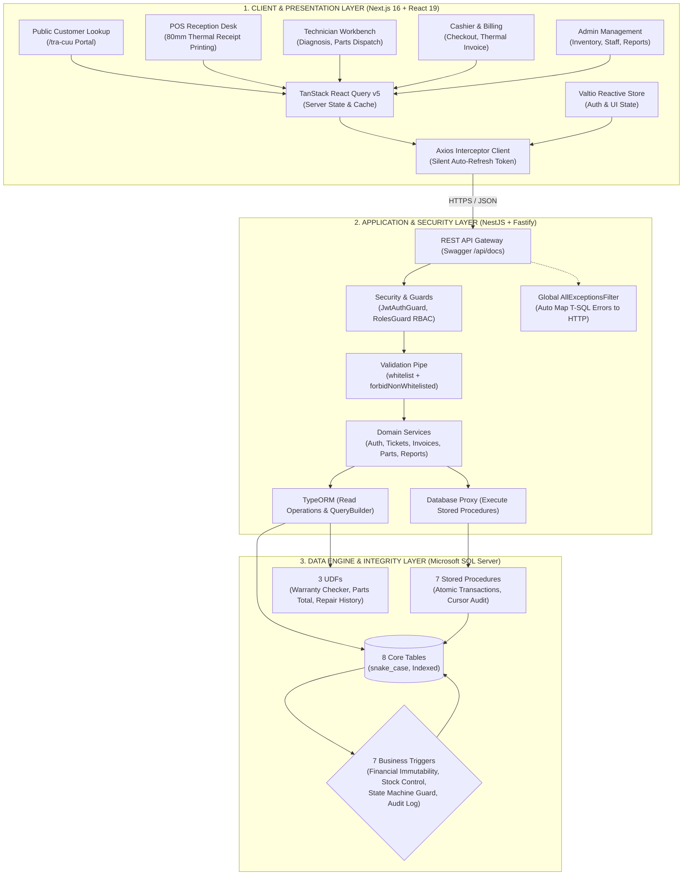

# UIT CARE — Enterprise After-Sales Service CRM & Warranty Management System

> **A robust, production-grade platform for After-Sales Service Management, POS Device Intake, Repair Dispatch, and Immutable Financial Audit Controls.**  
> Built as a modern full-stack monorepo integrating a high-integrity Database Engine (Microsoft SQL Server 2022), a high-performance REST API Gateway (NestJS 11 + Fastify), and an intuitive Web Portal (Next.js 16 + React 19 + Tailwind CSS v4).

---

## 1. System Architecture



---

## 2. Monorepo Repository Layout

```text
warranty_management/
├── database/                          # Database Migration, Seed Scripts & Documentation
│   ├── migrations/
│   │   ├── 01_schema.sql              # 8 Core Tables & Integrity Constraints
│   │   ├── 02_functions.sql           # 3 Scalar & Table-Valued Functions (UDFs)
│   │   ├── 03_triggers.sql            # 7 Business & Financial Immutability Triggers
│   │   ├── 04_procedures.sql          # 7 Stored Procedures & Audit Cursors
│   │   └── 05_seed_data.sql           # Realistic baseline data for 20 scenarios
│   ├── docs/                          # Specialized Database Technical Documentation (Vietnamese)
│   │   ├── 01_entities_and_erd.md     # 8 Entities, Data Dictionary & Mermaid ERD
│   │   ├── 02_triggers_and_immutability.md # 7 Triggers & Financial Lock Mechanics
│   │   ├── 03_procedures_and_functions.md  # 7 Stored Procedures & 3 UDFs
│   │   └── README.md                  # Database Documentation Index
│   ├── init-db.sql                    # Consolidated Master Database Init Script
│   └── setup.sh                       # Sequential container migration runner
│
├── core/                              # Core API Service (NestJS 11 + Fastify) - [warranty-core]
│   ├── src/
│   │   ├── common/                    # Filters, Guards, Decorators, Shared Helpers & DTOs
│   │   ├── config/                    # Database, JWT, and Environment Configurations
│   │   ├── database/entities/         # 8 TypeORM Entity Mappings
│   │   ├── modules/                   # Domain Modules: auth, tickets, invoices, customers, devices, parts, employees, reports
│   │   ├── app.module.ts
│   │   └── main.ts
│   ├── Dockerfile                     # Multi-stage Dockerfile (dev, build, production)
│   ├── tsconfig.json                  # Clean '@/*' Path Aliases
│   └── package.json
│
├── crm/                               # CRM Web Portal (Next.js 16 + React 19) - [warranty-crm]
│   ├── src/
│   │   ├── app/                       # Next.js App Router (Dashboard, Lookup, Login, POS Desks)
│   │   ├── common/constants/          # Design System Color Tokens & Constants
│   │   ├── components/                # Reusable UI Primitives (Card, Button, BaseModal, DataTable)
│   │   ├── features/                  # Domain Features: reception, tickets, technician, cashier, inventory, employees
│   │   ├── hooks/                     # Custom TanStack React Query & Business Hooks
│   │   ├── lib/                       # Axios Client with Silent JWT Auto-Refresh
│   │   └── stores/                    # Valtio Reactive Auth Store
│   ├── Dockerfile                     # Multi-stage Dockerfile (dev, build, production)
│   └── package.json
│
├── docker-compose.yml                 # 1-Click Multi-Service Orchestrator (Ports 1433, 5001, 3000)
├── .env.example                       # Root Environment Template
└── README.md                          # Project Documentation
```

---

## 3. Layer Architecture Deep-Dive

### 3.1 Data Engine & Integrity (Microsoft SQL Server 2022)
The database serves as the final line of defense for business logic and financial integrity:

1. **8 Normalized Core Entities**:
   - `customers`: Customer directory indexed on phone numbers.
   - `employees`: Personnel management, password hashing, refresh token hashes, and RBAC roles (`receptionist`, `technician`, `manager`).
   - `devices`: Customer devices with unique serial numbers and warranty timestamps.
   - `parts`: Spare parts inventory, unit prices, and real-time stock levels.
   - `tickets`: Service intake tickets governed by a 7-stage workflow (`received`, `inspecting`, `waiting_for_parts`, `repairing`, `completed`, `delivered`, `cancelled`).
   - `invoices`: Service invoices (labor fees, warranty discounts, final totals, payment methods).
   - `invoice_items`: Billable replacement parts with `total_price` defined as a **`PERSISTED` Computed Column**.
   - `ticket_status_history`: Tamper-proof audit trail capturing status transitions, actor IDs, notes, and timestamps.

2. **Financial Immutability Triggers**:
   - `trg_invoice_items_freeze_paid`: Blocks any `INSERT`, `UPDATE`, or `DELETE` on invoice items once the invoice is marked as `paid` (T-SQL Error `50035`).
   - `trg_invoices_freeze_paid_amounts`: Rejects modifications to labor cost, discount, total amount, or status rollback for settled invoices (T-SQL Error `50036`).

3. **Workflow & Inventory Protection**:
   - `trg_invoice_items_stock`: Automatically adjusts stock levels upon part allocation; rolls back transactions if stock drops below zero (T-SQL Error `50001`).
   - `trg_tickets_workflow_guard`: Enforces technician assignment before starting repairs (Error `50003`); blocks reopening of `delivered` tickets and prevents delivery before `completed` status (Error `50004`).
   - `trg_tickets_audit_history`: Automatically logs status changes into `ticket_status_history`.

4. **Stored Procedures & UDFs**:
   - `sp_receive_device`: Atomic intake procedure preventing concurrent active tickets for the same device.
   - `sp_create_invoice`: Automatically applies a 100% labor discount for warranty (`warranty`) and rework (`re_repair`) tickets.
   - `sp_checkout_invoice`: Marks an invoice as `paid` and delivers the ticket within a single atomic database transaction.
   - `sp_audit_invoices`: Cursor-based audit procedure that reconciles calculated totals against invoice headers and supports auto-fixing (`@auto_fix = 1`).
   - `sp_alert_delayed_tickets`: Identifies delayed tickets exceeding SLA thresholds (default >14 days).

> 📖 **Comprehensive Database Documentation (in Vietnamese):**
> Detailed technical references, ERD diagrams, and trigger specifications are maintained in Vietnamese under `database/docs/`:
> - [01. Thiết kế 8 Bảng & Sơ đồ ERD Mermaid](database/docs/01_entities_and_erd.md)
> - [02. Chi tiết 7 Triggers & Khóa tài chính bất biến](database/docs/02_triggers_and_immutability.md)
> - [03. Chi tiết 7 Stored Procedures & 3 Functions](database/docs/03_procedures_and_functions.md)
> - [Mục lục Database Documentation](database/docs/README.md)

---

### 3.2 Core API Service (NestJS + Fastify)
The API service acts as a high-speed gateway, identity verifier, and business coordinator:

- **Global T-SQL Error Mapping (`AllExceptionsFilter`)**: Intercepts custom database error codes (`50001`, `50004`, `50035`, `50036`) and maps them to semantic HTTP responses (`400 Bad Request`, `409 Conflict`, `422 Unprocessable Entity`) with user-friendly error messages.
- **Dual Authentication & Security**: Supports both `Bearer JWT` headers and `HttpOnly` cookies. Passwords and refresh tokens are salted and hashed with `bcryptjs`.
- **Role-Based Access Control (RBAC)**: Enforced via `RolesGuard` using the `@Roles(Role.MANAGER, Role.RECEPTIONIST, Role.TECHNICIAN)` decorator.
- **Strict Validation Pipeline**: Global `ValidationPipe` with `whitelist: true`, `forbidNonWhitelisted: true`, and `transform: true` ensuring clean request contracts.
- **Clean Path Aliasing**: All modules use `@/*` imports with zero messy `../../` relative paths, compiled cleanly via `nest build && tsc-alias`.

---

### 3.3 CRM Web Portal (Next.js 16 + React 19)
A modern, operational web interface optimized for Service Desk and POS counter speed:

- **Domain-Driven Modular Features**: Dedicated feature folders (`reception`, `tickets`, `technician`, `cashier`, `inventory`, `employees`) containing their own components, hooks, and configs.
- **Silent JWT Auto-Refresh**: Axios interceptor captures `401 Unauthorized` responses, queues pending requests, fetches a new access token via `/auth/refresh`, and seamlessly replays calls without interrupting the user.
- **Strict Tokenized Design System**: Zero arbitrary hex colors in TSX code. Colors strictly use semantic tokens (`bg-sand-50`, `border-sand-200`, `bg-bronze-600`) and constants from `@/common/constants`.
- **80mm POS Thermal Receipt Printing**: Tailored `@media print` CSS for immediate printing of receipt slips and customer invoices on POS thermal printers.

---

## 4. Quick Start with Docker (Recommended)

The entire system is containerized from the root directory. You can start all 3 services with a **single command**.

### 4.1 Port Mapping & Service Endpoints

Once Docker is up, all **3 ports** are accessible directly on your host machine:

| Service | Container Name | Host Port | Direct URL / Access Point | Purpose |
| :--- | :--- | :--- | :--- | :--- |
| **CRM Web Portal** | `warranty_crm` | **`3000`** | [`http://localhost:3000`](http://localhost:3000) | Operational Web CRM & Public Lookup Portal |
| **Core API Gateway** | `warranty_core` | **`5001`** | [`http://localhost:5001/api`](http://localhost:5001/api) | High-performance REST API Gateway |
| **API Docs (Swagger)**| `warranty_core` | **`5001`** | [`http://localhost:5001/api/docs`](http://localhost:5001/api/docs) | Interactive OpenAPI / Swagger Documentation |
| **Database (MSSQL)** | `warranty_mssql` | **`1433`** | `localhost:1433` (`sa` / `Warranty@Pass123`) | Direct connection for SSMS, DBeaver, Azure Data Studio |
| **DB Auto-Migrator** | `warranty_db_init` | *(Ephemeral)*| Runs migrations and exits `0` | Automatically seeds schema, triggers, procs & sample data |

---

### 4.2 Start System with Docker Compose

From the **project root** (`warranty_management/`), run:

```bash
# 1. Build images and start all 3 services in background mode
docker compose up -d --build

# 2. Check container status
docker compose ps

# 3. Stream live logs from all services
docker compose logs -f
```

> **Automated Orchestration Pipeline:**
> 1. `warranty_mssql` initializes the Microsoft SQL Server 2022 instance on port `1433`.
> 2. Once SQL Server passes health checks (`healthcheck: healthy`), `warranty_db_init` runs sequential migrations and seeds 140 realistic business records.
> 3. Once the database is ready, `warranty_core` launches on port `5001`.
> 4. `warranty_crm` launches on port `3000` and immediately binds to the Core API.

---

### 4.3 Useful Docker Commands

```bash
# Stop all services while preserving database volume data
docker compose down

# Wipe database volume and rebuild clean from scratch
docker compose down -v
docker compose up -d --build

# Re-run migration scripts manually
docker compose run --rm db-init

# Execute Master init-db.sql directly into MSSQL container
docker exec -i warranty_mssql /opt/mssql-tools18/bin/sqlcmd -S localhost -U sa -P Warranty@Pass123 -C -i /docker-entrypoint-initdb.d/init-db.sql
```

---

### 4.4 Local Development Mode (Without Containerizing Core / CRM)

If you prefer debugging source code directly on your local machine with hot reload:

#### 1. Start MSSQL via Docker
```bash
docker compose up -d database db-init
# Database is ready on localhost:1433 with full seed data
```

#### 2. Start Core API Service (Port 5001)
```bash
cd core
cp .env.example .env
pnpm install
pnpm run start:dev
```

#### 3. Start CRM Web Portal (Port 3000)
```bash
cd crm
cp .env.example .env.local
pnpm install
pnpm run dev
```

---

## 5. Pre-seeded Demo Accounts

The CRM includes a **1-Click Demo** feature on the login screen (`/login`):

| Username | Password | Role | Business Scope & Permissions |
| :--- | :--- | :--- | :--- |
| **`admin`** | `Admin@123` | **Manager** | Full system access: Analytics Dashboard, Inventory replenishment, Staff management, Invoice reconciliation |
| **`reception1`** | `Reception@123` | **Receptionist** | Front counter POS: Customer intake, 80mm receipt printing, Cashier checkout & device handover |
| **`tech1`** | `Tech@123` | **Technician** | Workbench: Ticket diagnosis, Part allocation from stock, Status updates |

---

## 6. Testing & Quality Assurance

```bash
# Run Core API Unit Tests
cd core
pnpm run test

# Run Core Production Build
cd core
pnpm run build

# Run CRM Linting
cd crm
pnpm run lint          # Standard ESLint check
pnpm run build         # Production Turbopack Build
```

---

## 7. License & Credits

Built with precision for enterprise service workflows and warranty operations. Distributed under standard university and commercial project guidelines.
