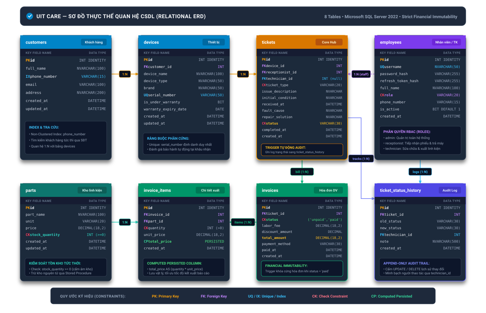

# Database Architecture: Entities & ERD

> **Hệ quản trị CSDL**: Microsoft SQL Server (T-SQL)  
> **Bộ mã hóa ký tự**: Unicode UTF-16 / `NVARCHAR`  
> **Quy chuẩn đặt tên (Naming Convention)**: `snake_case` tiếng Anh chuẩn quốc tế.

---

## 1. Sơ Đồ Thực Thể Quan Hệ (Entity-Relationship Diagram - ERD)

### 1.1 Sơ Đồ Trực Quan (Vector Visual Diagram)

---

### 1.2 Mã Nguồn Sơ Đồ Mermaid (Mermaid Source Code)

---

## 2. Từ Điển Dữ Liệu Chi Tiết (Data Dictionary)

### 2.1 Bảng `customers` (Khách hàng)
Lưu trữ hồ sơ khách hàng sử dụng dịch vụ tiếp nhận, sửa chữa và bảo hành.

| Tên Cột | Kiểu Dữ Liệu | Ràng Buộc | Ý Nghĩa Nghiệp Vụ |
|:---|:---|:---|:---|
| `id` | `INT IDENTITY(1,1)` | `PRIMARY KEY` | Định danh khách hàng duy nhất. |
| `full_name` | `NVARCHAR(100)` | `NOT NULL` | Họ và tên khách hàng. |
| `phone_number` | `VARCHAR(15)` | `NOT NULL`, `INDEX` | Số điện thoại dùng để tra cứu nhanh tại quầy POS. |
| `email` | `VARCHAR(100)` | `NULL` | Thư điện tử nhận thông báo trạng thái phiếu. |
| `address` | `NVARCHAR(200)` | `NULL` | Địa chỉ liên lạc / giao nhận thiết bị. |
| `created_at` | `DATETIME` | `DEFAULT GETDATE()` | Thời điểm tạo hồ sơ. |
| `updated_at` | `DATETIME` | `DEFAULT GETDATE()` | Thời điểm cập nhật hồ sơ gần nhất. |

---

### 2.2 Bảng `employees` (Nhân sự & Tài khoản hệ thống)
Quản lý thông tin đăng nhập, vai trò (RBAC) và xác thực người dùng.

| Tên Cột | Kiểu Dữ Liệu | Ràng Buộc | Ý Nghĩa Nghiệp Vụ |
|:---|:---|:---|:---|
| `id` | `INT IDENTITY(1,1)` | `PRIMARY KEY` | Mã nhân viên duy nhất. |
| `username` | `NVARCHAR(50)` | `NOT NULL UNIQUE` | Tên tài khoản đăng nhập phiên làm việc. |
| `password_hash` | `VARCHAR(255)` | `NOT NULL` | Mật khẩu băm an toàn bằng thuật toán `bcryptjs`. |
| `refresh_token_hash`| `VARCHAR(255)` | `NULL` | Băm của refresh token để chống token theft. |
| `full_name` | `NVARCHAR(100)` | `NOT NULL` | Họ tên hiển thị trên biên nhận/hóa đơn. |
| `role` | `VARCHAR(20)` | `NOT NULL`, `CHECK` | Phân quyền: `receptionist` (Lễ tân), `technician` (KTV), `manager` (Quản lý). |
| `phone_number` | `VARCHAR(15)` | `NULL` | Điện thoại liên hệ nội bộ. |
| `email` | `VARCHAR(100)` | `NULL` | Email công vụ của nhân viên. |
| `is_active` | `BIT` | `DEFAULT 1` | Trạng thái hoạt động tài khoản (1: Khả dụng, 0: Khóa). |
| `created_at` | `DATETIME` | `DEFAULT GETDATE()` | Thời điểm khởi tạo nhân sự. |
| `updated_at` | `DATETIME` | `DEFAULT GETDATE()` | Thời điểm cập nhật hồ sơ nhân sự. |

---

### 2.3 Bảng `devices` (Thiết bị)
Định danh từng thiết bị vật lý của khách hàng gửi vào trung tâm dịch vụ.

| Tên Cột | Kiểu Dữ Liệu | Ràng Buộc | Ý Nghĩa Nghiệp Vụ |
|:---|:---|:---|:---|
| `id` | `INT IDENTITY(1,1)` | `PRIMARY KEY` | Mã định danh thiết bị. |
| `customer_id` | `INT` | `FOREIGN KEY (customers)` | Chủ sở hữu thiết bị. |
| `device_name` | `NVARCHAR(100)` | `NOT NULL` | Tên thương mại (VD: Macbook Pro 14 M2, Dell XPS 13). |
| `device_type` | `NVARCHAR(50)` | `NULL` | Phân loại thiết bị (Laptop, Smartphone, Tablet...). |
| `brand` | `NVARCHAR(50)` | `NULL` | Hãng sản xuất (Apple, Dell, Asus, Samsung...). |
| `serial_number` | `VARCHAR(50)` | `UNIQUE NULL` | Số Serial / IMEI duy nhất của máy. |
| `is_under_warranty` | `BIT` | `DEFAULT 0` | Cờ bảo hành chính hãng (1: Còn hạn, 0: Hết hạn). |
| `warranty_expiry_date`| `DATE` | `NULL` | Ngày hết hạn bảo hành chính hãng. |
| `created_at` | `DATETIME` | `DEFAULT GETDATE()` | Ngày ghi nhận thiết bị vào hệ thống. |
| `updated_at` | `DATETIME` | `DEFAULT GETDATE()` | Ngày cập nhật thông tin thiết bị. |

---

### 2.4 Bảng `parts` (Kho linh kiện sửa chữa)
Kiểm soát tồn kho và đơn giá bán ra của linh kiện thay thế.

| Tên Cột | Kiểu Dữ Liệu | Ràng Buộc | Ý Nghĩa Nghiệp Vụ |
|:---|:---|:---|:---|
| `id` | `INT IDENTITY(1,1)` | `PRIMARY KEY` | Mã linh kiện trong kho. |
| `part_name` | `NVARCHAR(100)` | `NOT NULL` | Tên mô tả linh kiện (VD: Pin Macbook A2338, Màn hình OLED). |
| `unit` | `VARCHAR(20)` | `NOT NULL` | Đơn vị tính (Cái, Cụm, Bộ, Tuýp keo...). |
| `price` | `DECIMAL(18,2)` | `NOT NULL, CHECK >= 0` | Đơn giá xuất bán linh kiện (VND). |
| `stock_quantity` | `INT` | `NOT NULL, CHECK >= 0` | Số lượng tồn kho thực tế, bảo vệ bởi trigger chống âm kho. |
| `created_at` | `DATETIME` | `DEFAULT GETDATE()` | Ngày tạo mặt hàng trong kho. |
| `updated_at` | `DATETIME` | `DEFAULT GETDATE()` | Ngày cập nhật tồn kho/đơn giá. |

---

### 2.5 Bảng `tickets` (Phiếu tiếp nhận & sửa chữa)
Trọng tâm luồng công việc (State Machine) của hệ thống dịch vụ.

| Tên Cột | Kiểu Dữ Liệu | Ràng Buộc | Ý Nghĩa Nghiệp Vụ |
|:---|:---|:---|:---|
| `id` | `INT IDENTITY(1,1)` | `PRIMARY KEY` | Số phiếu tiếp nhận (Mã biên nhận). |
| `device_id` | `INT` | `FOREIGN KEY (devices)` | Thiết bị cần xử lý. |
| `receptionist_id` | `INT` | `FOREIGN KEY (employees)` | Lễ tân lập phiếu tiếp nhận ban đầu. |
| `technician_id` | `INT` | `FOREIGN KEY (employees) NULL`| Kỹ thuật viên phụ trách chẩn đoán & sửa chữa. |
| `ticket_type` | `VARCHAR(20)` | `CHECK` | Phân loại: `repair` (Sửa tính phí), `warranty` (Bảo hành miễn phí), `re_repair` (Sửa lại). |
| `issue_description` | `NVARCHAR(500)` | `NULL` | Lỗi do khách hàng phản ánh khi gửi máy. |
| `initial_condition` | `NVARCHAR(200)` | `NULL` | Hiện trạng ngoại quan máy khi tiếp nhận (vết trầy, đủ ốc...). |
| `accessories` | `NVARCHAR(200)` | `NULL` | Phụ kiện gửi kèm (sạc, cáp, túi chống sốc...). |
| `received_at` | `DATETIME` | `NOT NULL DEFAULT GETDATE()` | Thời điểm nhận máy tại quầy POS. |
| `fault_cause` | `NVARCHAR(500)` | `NULL` | Nguyên nhân hư hỏng do KTV xác định sau khi tháo máy kiểm tra. |
| `repair_solution` | `NVARCHAR(500)` | `NULL` | Phương án xử lý kỹ thuật (hàn chip, thay cụm linh kiện...). |
| `estimated_cost` | `DECIMAL(18,2)` | `DEFAULT 0, CHECK >= 0` | Chi phí dự kiến báo cho khách hàng trước khi làm. |
| `status` | `VARCHAR(30)` | `CHECK 7 statuses` | Tiến trình: `received` -> `inspecting` -> `waiting_for_parts` -> `repairing` -> `completed` -> `delivered` / `cancelled`. |
| `completed_at` | `DATETIME` | `NULL, CHECK >= received_at` | Thời điểm hoàn thành sửa chữa (tự động điền bởi trigger). |
| `created_at` | `DATETIME` | `DEFAULT GETDATE()` | Thời điểm tạo phiếu trong DB. |
| `updated_at` | `DATETIME` | `DEFAULT GETDATE()` | Thời điểm cập nhật phiếu gần nhất. |

---

### 2.6 Bảng `invoices` (Hóa đơn dịch vụ)
Kiểm soát tiền công, chiết khấu và trạng thái thanh toán.

| Tên Cột | Kiểu Dữ Liệu | Ràng Buộc | Ý Nghĩa Nghiệp Vụ |
|:---|:---|:---|:---|
| `id` | `INT IDENTITY(1,1)` | `PRIMARY KEY` | Số hóa đơn thanh toán. |
| `ticket_id` | `INT` | `FOREIGN KEY (tickets)` | Phiếu sửa chữa tương ứng. |
| `status` | `VARCHAR(30)` | `CHECK ('unpaid','paid')` | Trạng thái thanh toán (Khóa bất biến một khi đã `paid`). |
| `labor_fee` | `DECIMAL(18,2)` | `DEFAULT 0, CHECK >= 0` | Tiền công dịch vụ kỹ thuật. |
| `discount_amount` | `DECIMAL(18,2)` | `DEFAULT 0, CHECK >= 0` | Số tiền giảm trừ (tự động = 100% tiền công nếu là `warranty`). |
| `total_amount` | `DECIMAL(18,2)` | `DEFAULT 0, CHECK >= 0` | Tổng tiền thanh toán = `labor_fee` - `discount_amount` + tổng linh kiện. |
| `payment_method` | `VARCHAR(30)` | `NULL, CHECK` | Phương thức: `cash` (Tiền mặt), `bank_transfer` (Chuyển khoản), `credit_card` (Thẻ). |
| `paid_at` | `DATETIME` | `NULL` | Thời điểm xác nhận thanh toán thành công. |
| `created_at` | `DATETIME` | `DEFAULT GETDATE()` | Thời điểm tạo hóa đơn. |
| `updated_at` | `DATETIME` | `DEFAULT GETDATE()` | Thời điểm cập nhật hóa đơn. |

---

### 2.7 Bảng `invoice_items` (Chi tiết linh kiện hóa đơn)
Bóc tách từng món linh kiện được xuất dùng cho phiếu sửa chữa.

| Tên Cột | Kiểu Dữ Liệu | Ràng Buộc | Ý Nghĩa Nghiệp Vụ |
|:---|:---|:---|:---|
| `id` | `INT IDENTITY(1,1)` | `PRIMARY KEY` | Mã dòng chi tiết. |
| `invoice_id` | `INT` | `FOREIGN KEY (invoices)` | Hóa đơn liên kết. |
| `part_id` | `INT` | `FOREIGN KEY (parts)` | Linh kiện xuất kho. |
| `quantity` | `INT` | `NOT NULL, CHECK > 0` | Số lượng xuất dùng. |
| `unit_price` | `DECIMAL(18,2)` | `NOT NULL, CHECK >= 0` | Đơn giá tại thời điểm xuất. |
| `total_price` | `DECIMAL(18,2)` | `AS (quantity * unit_price) PERSISTED` | **Computed Column được lưu vật lý**, tối ưu truy vấn O(1) và loại bỏ rủi ro sai lệch số nhân. |
| `created_at` | `DATETIME` | `DEFAULT GETDATE()` | Thời điểm gắn linh kiện vào phiếu. |

---

### 2.8 Bảng `ticket_status_history` (Nhật ký chuyển trạng thái - Audit Trail)
Ghi nhận đầy đủ vết biến động trạng thái phục vụ đối soát và quản lý chất lượng dịch vụ SLA.

| Tên Cột | Kiểu Dữ Liệu | Ràng Buộc | Ý Nghĩa Nghiệp Vụ |
|:---|:---|:---|:---|
| `id` | `INT IDENTITY(1,1)` | `PRIMARY KEY` | Mã sự kiện chuyển đổi. |
| `ticket_id` | `INT` | `FOREIGN KEY (tickets) ON DELETE CASCADE` | Phiếu sửa chữa được theo dõi. |
| `old_status` | `VARCHAR(30)` | `NULL` | Trạng thái trước khi chuyển (NULL nếu mới tạo). |
| `new_status` | `VARCHAR(30)` | `NOT NULL` | Trạng thái mới được xác lập. |
| `technician_id` | `INT` | `FOREIGN KEY (employees) NULL` | Nhân sự thực hiện chuyển đổi trạng thái. |
| `note` | `NVARCHAR(500)` | `NULL` | Ghi chú lý do chuyển trạng thái. |
| `created_at` | `DATETIME` | `NOT NULL DEFAULT GETDATE()` | Dấu mốc thời gian chính xác của sự kiện. |

---

## 3. Ma Trận Ánh Xạ: Thao Tác UI/Dashboard ⟷ Database Objects

Hệ thống được thiết kế theo nguyên tắc **Zero-Trust Data Integrity**: Mọi thao tác trên giao diện Web Dashboard đều được kiểm soát và bảo vệ tự động bằng 4 nhóm đối tượng CSDL.

---

### 3.1 Nhóm 1: Gom Theo Database Triggers (7 Triggers)

| Tên Trigger | Bảng Tác Động | Sự Kiện | Thao Tác Tương Ứng Trên UI Dashboard | Logic Tự Động Hóa & Ràng Buộc | Mã Lỗi Rollback |
|:---|:---|:---:|:---|:---|:---:|
| **`trg_invoice_items_stock`** | `invoice_items` | `INSERT` `UPDATE` `DELETE` | • KTV thêm linh kiện vào báo giá (INSERT) • KTV sửa số lượng linh kiện (UPDATE) • KTV bấm icon thùng rác xóa linh kiện (DELETE) | • Tự động trừ kho `parts.stock_quantity` • Tự động tính delta điều chỉnh kho • Tự động hoàn trả linh kiện về kho khi xóa • Chặn đứng giao dịch nếu tồn kho bị âm | **`50001`** *(Kho không đủ số lượng)* |
| **`trg_invoices_total_amount`** | `invoice_items` | `INSERT` `UPDATE` `DELETE` | Bất kỳ thao tác thêm, sửa số lượng, hoặc gỡ linh kiện khỏi hóa đơn | Tự động tính lại tổng tiền hóa đơn `invoices.total_amount` qua hàm `fn_calculate_parts_total` | — |
| **`trg_invoices_labor_update`** | `invoices` | `INSERT` `UPDATE` | Lễ tân / KTV chỉnh sửa tiền công (`labor_fee`) hoặc chiết khấu (`discount_amount`) | Tự động cập nhật `total_amount = MAX(0, labor_fee - discount_amount) + linh kiện` | — |
| **`trg_tickets_workflow_guard`** | `tickets` | `INSERT` `UPDATE` | • KTV đổi trạng thái sang `inspecting`, `repairing`, `completed` • Lễ tân bấm bàn giao máy (`delivered`) | • Bắt buộc phân công KTV trước khi chuyển trạng thái kỹ thuật • Ngăn nhảy cóc sang `delivered` khi chưa `completed` • Cấm mở lại phiếu đã bàn giao • Tự động điền `completed_at = GETDATE()` | **`50003`** *(Thiếu KTV)* **`50004`** *(Sai tiến trình)* |
| **`trg_tickets_audit_history`** | `tickets` | `INSERT` `UPDATE` | Bất kỳ thao tác tạo phiếu mới hoặc đổi trạng thái phiếu | Tự động bắt sự kiện và ghi vết nhật ký vào `ticket_status_history` (`old_status`, `new_status`, `technician_id`, `created_at`) | — |
| **`trg_invoice_items_freeze_paid`** | `invoice_items` | `INSERT` `UPDATE` `DELETE` | Bất kỳ ai cố tình gửi lệnh thêm, sửa, xóa linh kiện của HĐ đã thanh toán | **Khóa tài chính cấp dòng**: Cấm tuyệt đối chỉnh sửa danh mục linh kiện một khi hóa đơn đã `paid` | **`50035`** *(HĐ đã thanh toán)* |
| **`trg_invoices_freeze_paid_amounts`** | `invoices` | `UPDATE` | Bất kỳ ai cố tình sửa tiền hoặc chuyển trạng thái từ `paid` về `unpaid` | **Khóa tài chính cấp hóa đơn**: Đóng băng vĩnh viễn số tiền và cấm đảo ngược trạng thái | **`50036`** *(HĐ đã thanh toán)* |

---

### 3.2 Nhóm 2: Gom Theo Database Cursors (2 Con Trỏ T-SQL)

| Tên Cursor | Nằm Trong Thủ Tục | Màn Hình / Thao Tác Trên UI | Cơ Chế Duyệt Con Trỏ & Mục Đích Nghiệp Vụ |
|:---|:---|:---|:---|
| **`cur_delayed_tickets`** | `dbo.sp_alert_delayed_tickets` | **Dashboard Giám Đốc (`/dashboard`)**: Mở trang hoặc bấm nút **"Làm mới"** $\rightarrow$ Widget *"Phiếu quá hạn SLA (>14 ngày)"* | Con trỏ duyệt tuần tự qua từng phiếu đang mở quá hạn SLA (>14 ngày), JOIN thông tin khách hàng, thiết bị và KTV phụ trách, tính chính xác số ngày trễ nạp vào dataset cho Dashboard hiển thị cảnh báo đỏ. |
| **`cur_invoices`** | `dbo.sp_audit_invoices` | **Dashboard Giám Đốc (`/dashboard`)**: Bấm nút **"Đối soát hóa đơn & Doanh thu"** $\rightarrow$ Bấm **"Bắt đầu quét đối soát"** | Con trỏ duyệt qua 100% hóa đơn trong CSDL, gọi hàm `fn_calculate_parts_total` để so khớp tổng tiền thực tế với `total_amount`. Nếu bật `auto_fix = 1`, con trỏ tự động sửa đúng số tiền cho từng hóa đơn bị lệch. |

---

### 3.3 Nhóm 3: Gom Theo User-Defined Functions (3 Functions)

| Tên Function | Loại Hàm | Màn Hình / Vị Trí Gọi Trên Dashboard | Kết Quả Trả Về & Ứng Dụng Thực Tế |
|:---|:---:|:---|:---|
| **`dbo.fn_calculate_parts_total`** | Scalar | Gọi ngầm trong Triggers `trg_invoices_total_amount`, `trg_invoices_labor_update` và Stored Procedure `sp_audit_invoices` | Trả về tổng tiền linh kiện: $\sum(\text{quantity} \times \text{unit\_price})$ dạng `DECIMAL(18,2)`. |
| **`dbo.fn_is_device_under_warranty`** | Scalar | • **Màn hình Tiếp nhận (`/reception`)**: Khi tạo phiếu mới • **Màn hình Tra cứu (`/tra-cuu`)**: Khách tra cứu thiết bị | Trả về `1` (Còn bảo hành) hoặc `0` (Hết hạn). Tự động phân loại `warranty` (miễn phí) hay `repair` (tính phí); hiển thị badge xanh/vàng. |
| **`dbo.fn_get_device_repair_history`** | Table-Valued | • **Màn hình Tra cứu (`/tra-cuu`)** • **Modal Chi tiết máy (`/tickets`)** | Trả về bảng lịch sử sửa chữa đa tầng: Ngày nhận, mã phiếu, lỗi, linh kiện đã thay, KTV thực hiện và kết quả bàn giao. |

---

### 3.4 Nhóm 4: Gom Theo Stored Procedures (7 Thủ Tục)

| Stored Procedure | Màn Hình / Nút Bấm Trên UI | Nghiệp Vụ Thực Thi Nguyên Tử (ACID) |
|:---|:---|:---|
| **`dbo.sp_receive_device`** | Phân hệ Lễ tân (`/reception`) $\rightarrow$ Bấm **"Tạo phiếu tiếp nhận"** | Tạo khách $\rightarrow$ Tạo/cập nhật máy $\rightarrow$ Gọi hàm bảo hành $\rightarrow$ Tạo phiếu `received` $\rightarrow$ Kích hoạt trigger ghi audit. |
| **`dbo.sp_process_ticket`** | Bàn làm việc KTV (`/technician`) $\rightarrow$ Bấm **"Cập nhật tiến độ"** | Cập nhật trạng thái phiếu $\rightarrow$ Ghi nguyên nhân/giải pháp $\rightarrow$ Kích hoạt trigger kiểm tra KTV & tự điền `completed_at`. |
| **`dbo.sp_create_invoice`** | Màn hình Hóa đơn / KTV $\rightarrow$ Khởi tạo hóa đơn báo giá | Tạo hóa đơn cho phiếu $\rightarrow$ Gán tiền công & chiết khấu $\rightarrow$ Kích hoạt trigger tính tổng tiền. |
| **`dbo.sp_add_invoice_part`** | Modal Chẩn đoán $\rightarrow$ Chọn linh kiện kho $\rightarrow$ Bấm **"Thêm vào báo giá"** | Capture giá kho bất biến $\rightarrow$ Gán vào `invoice_items` $\rightarrow$ Kích hoạt trigger trừ kho & trigger tính lại tổng tiền. |
| **`dbo.sp_checkout_invoice`** | Phân hệ Thu ngân (`/cashier`) $\rightarrow$ Bấm **"Xác nhận thanh toán"** | Ghi nhận hình thức thanh toán $\rightarrow$ Gán `paid_at` $\rightarrow$ Đổi sang `paid` $\rightarrow$ Kích hoạt bộ đôi trigger khóa bất biến. |
| **`dbo.sp_alert_delayed_tickets`** | Dashboard Giám đốc (`/dashboard`) $\rightarrow$ Widget Cảnh báo trễ SLA | Sử dụng **Cursor `cur_delayed_tickets`** duyệt tìm các phiếu quá hạn > 14 ngày, trả về danh sách cảnh báo. |
| **`dbo.sp_audit_invoices`** | Dashboard Giám đốc (`/dashboard`) $\rightarrow$ Modal Đối soát doanh thu | Sử dụng **Cursor `cur_invoices`** duyệt đối soát 100% hóa đơn, tự động sửa sai số nếu bật `@auto_fix = 1`. |

---

### 3.5 Nhóm 5: Bảng Tra Cứu Theo User Actions (Từng Phân Hệ Dashboard)

| Phân Hệ Dashboard | Thao Tác Người Dùng | Trigger Kích Hoạt | Cursor Kích Hoạt | Function Kích Hoạt | Procedure Gọi |
|:---|:---|:---:|:---:|:---:|:---:|
| **Tiếp Nhận (`/reception`)** | Bấm **"Tạo phiếu tiếp nhận"** | `trg_tickets_audit_history` | — | `fn_is_device_under_warranty` | `sp_receive_device` |
| **Kỹ Thuật Viên (`/technician`)** | Bấm **"Cập nhật tiến độ"** | `trg_tickets_workflow_guard` `trg_tickets_audit_history` | — | — | `sp_process_ticket` |
| **Kỹ Thuật Viên (`/technician`)** | Bấm **"Thêm vào báo giá"** | `trg_invoice_items_stock` `trg_invoices_total_amount` `trg_invoice_items_freeze_paid` | — | `fn_calculate_parts_total` | `sp_add_invoice_part` |
| **Kỹ Thuật Viên (`/technician`)** | Bấm icon **Thùng rác xóa linh kiện** | `trg_invoice_items_stock` `trg_invoices_total_amount` `trg_invoice_items_freeze_paid` | — | `fn_calculate_parts_total` | Lệnh `DELETE` |
| **Kỹ Thuật Viên (`/technician`)** | Bấm **"Hoàn tất sửa chữa"** | `trg_tickets_workflow_guard` `trg_tickets_audit_history` | — | — | `sp_process_ticket` |
| **Thu Ngân (`/cashier`)** | Bấm **"Xác nhận thanh toán"** | `trg_invoices_freeze_paid_amounts` `trg_invoice_items_freeze_paid` | — | — | `sp_checkout_invoice` |
| **Quản Lý (`/dashboard`)** | Mở widget **"Phiếu trễ SLA"** | — | **`cur_delayed_tickets`** | — | `sp_alert_delayed_tickets` |
| **Quản Lý (`/dashboard`)** | Bấm **"Quét đối soát doanh thu"** | — | **`cur_invoices`** | `fn_calculate_parts_total` | `sp_audit_invoices` |
| **Khách Hàng (`/tra-cuu`)** | Bấm **"Tra cứu bảo hành"** | — | — | `fn_get_device_repair_history` `fn_is_device_under_warranty` | Query TVF |

> Xem tài liệu phân tích kỹ thuật chuyên sâu tại: [**`04_dashboard_actions_and_sql_execution.md`**](./04_dashboard_actions_and_sql_execution.md).
