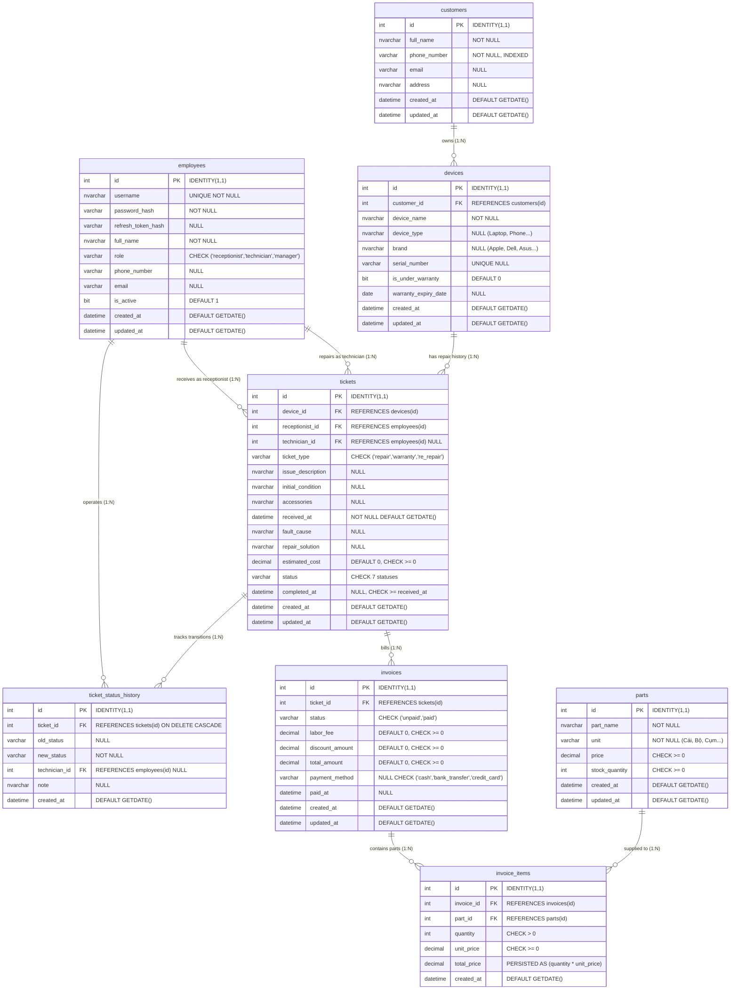

# Database Architecture: Entities & ERD

> **Hệ quản trị CSDL**: Microsoft SQL Server (T-SQL)  
> **Bộ mã hóa ký tự**: Unicode UTF-16 / `NVARCHAR`  
> **Quy chuẩn đặt tên (Naming Convention)**: `snake_case` tiếng Anh chuẩn quốc tế.

---

## 1. Sơ Đồ Thực Thể Quan Hệ (Entity-Relationship Diagram - ERD)

### 1.1 Sơ Đồ Trực Quan (Vector Visual Diagram)

---

### 1.2 Mã Nguồn Sơ Đồ Mermaid (Mermaid Source Code)

---

## 2. Từ Điển Dữ Liệu Chi Tiết (Data Dictionary)

### 2.1 Bảng `customers` (Khách hàng)
Lưu trữ hồ sơ khách hàng sử dụng dịch vụ tiếp nhận, sửa chữa và bảo hành.

| Tên Cột | Kiểu Dữ Liệu | Ràng Buộc | Ý Nghĩa Nghiệp Vụ |
|:---|:---|:---|:---|
| `id` | `INT IDENTITY(1,1)` | `PRIMARY KEY` | Định danh khách hàng duy nhất. |
| `full_name` | `NVARCHAR(100)` | `NOT NULL` | Họ và tên khách hàng. |
| `phone_number` | `VARCHAR(15)` | `NOT NULL`, `INDEX` | Số điện thoại dùng để tra cứu nhanh tại quầy POS. |
| `email` | `VARCHAR(100)` | `NULL` | Thư điện tử nhận thông báo trạng thái phiếu. |
| `address` | `NVARCHAR(200)` | `NULL` | Địa chỉ liên lạc / giao nhận thiết bị. |
| `created_at` | `DATETIME` | `DEFAULT GETDATE()` | Thời điểm tạo hồ sơ. |
| `updated_at` | `DATETIME` | `DEFAULT GETDATE()` | Thời điểm cập nhật hồ sơ gần nhất. |

---

### 2.2 Bảng `employees` (Nhân sự & Tài khoản hệ thống)
Quản lý thông tin đăng nhập, vai trò (RBAC) và xác thực người dùng.

| Tên Cột | Kiểu Dữ Liệu | Ràng Buộc | Ý Nghĩa Nghiệp Vụ |
|:---|:---|:---|:---|
| `id` | `INT IDENTITY(1,1)` | `PRIMARY KEY` | Mã nhân viên duy nhất. |
| `username` | `NVARCHAR(50)` | `NOT NULL UNIQUE` | Tên tài khoản đăng nhập phiên làm việc. |
| `password_hash` | `VARCHAR(255)` | `NOT NULL` | Mật khẩu băm an toàn bằng thuật toán `bcryptjs`. |
| `refresh_token_hash`| `VARCHAR(255)` | `NULL` | Băm của refresh token để chống token theft. |
| `full_name` | `NVARCHAR(100)` | `NOT NULL` | Họ tên hiển thị trên biên nhận/hóa đơn. |
| `role` | `VARCHAR(20)` | `NOT NULL`, `CHECK` | Phân quyền: `receptionist` (Lễ tân), `technician` (KTV), `manager` (Quản lý). |
| `phone_number` | `VARCHAR(15)` | `NULL` | Điện thoại liên hệ nội bộ. |
| `email` | `VARCHAR(100)` | `NULL` | Email công vụ của nhân viên. |
| `is_active` | `BIT` | `DEFAULT 1` | Trạng thái hoạt động tài khoản (1: Khả dụng, 0: Khóa). |
| `created_at` | `DATETIME` | `DEFAULT GETDATE()` | Thời điểm khởi tạo nhân sự. |
| `updated_at` | `DATETIME` | `DEFAULT GETDATE()` | Thời điểm cập nhật hồ sơ nhân sự. |

---

### 2.3 Bảng `devices` (Thiết bị)
Định danh từng thiết bị vật lý của khách hàng gửi vào trung tâm dịch vụ.

| Tên Cột | Kiểu Dữ Liệu | Ràng Buộc | Ý Nghĩa Nghiệp Vụ |
|:---|:---|:---|:---|
| `id` | `INT IDENTITY(1,1)` | `PRIMARY KEY` | Mã định danh thiết bị. |
| `customer_id` | `INT` | `FOREIGN KEY (customers)` | Chủ sở hữu thiết bị. |
| `device_name` | `NVARCHAR(100)` | `NOT NULL` | Tên thương mại (VD: Macbook Pro 14 M2, Dell XPS 13). |
| `device_type` | `NVARCHAR(50)` | `NULL` | Phân loại thiết bị (Laptop, Smartphone, Tablet...). |
| `brand` | `NVARCHAR(50)` | `NULL` | Hãng sản xuất (Apple, Dell, Asus, Samsung...). |
| `serial_number` | `VARCHAR(50)` | `UNIQUE NULL` | Số Serial / IMEI duy nhất của máy. |
| `is_under_warranty` | `BIT` | `DEFAULT 0` | Cờ bảo hành chính hãng (1: Còn hạn, 0: Hết hạn). |
| `warranty_expiry_date`| `DATE` | `NULL` | Ngày hết hạn bảo hành chính hãng. |
| `created_at` | `DATETIME` | `DEFAULT GETDATE()` | Ngày ghi nhận thiết bị vào hệ thống. |
| `updated_at` | `DATETIME` | `DEFAULT GETDATE()` | Ngày cập nhật thông tin thiết bị. |

---

### 2.4 Bảng `parts` (Kho linh kiện sửa chữa)
Kiểm soát tồn kho và đơn giá bán ra của linh kiện thay thế.

| Tên Cột | Kiểu Dữ Liệu | Ràng Buộc | Ý Nghĩa Nghiệp Vụ |
|:---|:---|:---|:---|
| `id` | `INT IDENTITY(1,1)` | `PRIMARY KEY` | Mã linh kiện trong kho. |
| `part_name` | `NVARCHAR(100)` | `NOT NULL` | Tên mô tả linh kiện (VD: Pin Macbook A2338, Màn hình OLED). |
| `unit` | `VARCHAR(20)` | `NOT NULL` | Đơn vị tính (Cái, Cụm, Bộ, Tuýp keo...). |
| `price` | `DECIMAL(18,2)` | `NOT NULL, CHECK >= 0` | Đơn giá xuất bán linh kiện (VND). |
| `stock_quantity` | `INT` | `NOT NULL, CHECK >= 0` | Số lượng tồn kho thực tế, bảo vệ bởi trigger chống âm kho. |
| `created_at` | `DATETIME` | `DEFAULT GETDATE()` | Ngày tạo mặt hàng trong kho. |
| `updated_at` | `DATETIME` | `DEFAULT GETDATE()` | Ngày cập nhật tồn kho/đơn giá. |

---

### 2.5 Bảng `tickets` (Phiếu tiếp nhận & sửa chữa)
Trọng tâm luồng công việc (State Machine) của hệ thống dịch vụ.

| Tên Cột | Kiểu Dữ Liệu | Ràng Buộc | Ý Nghĩa Nghiệp Vụ |
|:---|:---|:---|:---|
| `id` | `INT IDENTITY(1,1)` | `PRIMARY KEY` | Số phiếu tiếp nhận (Mã biên nhận). |
| `device_id` | `INT` | `FOREIGN KEY (devices)` | Thiết bị cần xử lý. |
| `receptionist_id` | `INT` | `FOREIGN KEY (employees)` | Lễ tân lập phiếu tiếp nhận ban đầu. |
| `technician_id` | `INT` | `FOREIGN KEY (employees) NULL`| Kỹ thuật viên phụ trách chẩn đoán & sửa chữa. |
| `ticket_type` | `VARCHAR(20)` | `CHECK` | Phân loại: `repair` (Sửa tính phí), `warranty` (Bảo hành miễn phí), `re_repair` (Sửa lại). |
| `issue_description` | `NVARCHAR(500)` | `NULL` | Lỗi do khách hàng phản ánh khi gửi máy. |
| `initial_condition` | `NVARCHAR(200)` | `NULL` | Hiện trạng ngoại quan máy khi tiếp nhận (vết trầy, đủ ốc...). |
| `accessories` | `NVARCHAR(200)` | `NULL` | Phụ kiện gửi kèm (sạc, cáp, túi chống sốc...). |
| `received_at` | `DATETIME` | `NOT NULL DEFAULT GETDATE()` | Thời điểm nhận máy tại quầy POS. |
| `fault_cause` | `NVARCHAR(500)` | `NULL` | Nguyên nhân hư hỏng do KTV xác định sau khi tháo máy kiểm tra. |
| `repair_solution` | `NVARCHAR(500)` | `NULL` | Phương án xử lý kỹ thuật (hàn chip, thay cụm linh kiện...). |
| `estimated_cost` | `DECIMAL(18,2)` | `DEFAULT 0, CHECK >= 0` | Chi phí dự kiến báo cho khách hàng trước khi làm. |
| `status` | `VARCHAR(30)` | `CHECK 7 statuses` | Tiến trình: `received` -> `inspecting` -> `waiting_for_parts` -> `repairing` -> `completed` -> `delivered` / `cancelled`. |
| `completed_at` | `DATETIME` | `NULL, CHECK >= received_at` | Thời điểm hoàn thành sửa chữa (tự động điền bởi trigger). |
| `created_at` | `DATETIME` | `DEFAULT GETDATE()` | Thời điểm tạo phiếu trong DB. |
| `updated_at` | `DATETIME` | `DEFAULT GETDATE()` | Thời điểm cập nhật phiếu gần nhất. |

---

### 2.6 Bảng `invoices` (Hóa đơn dịch vụ)
Kiểm soát tiền công, chiết khấu và trạng thái thanh toán.

| Tên Cột | Kiểu Dữ Liệu | Ràng Buộc | Ý Nghĩa Nghiệp Vụ |
|:---|:---|:---|:---|
| `id` | `INT IDENTITY(1,1)` | `PRIMARY KEY` | Số hóa đơn thanh toán. |
| `ticket_id` | `INT` | `FOREIGN KEY (tickets)` | Phiếu sửa chữa tương ứng. |
| `status` | `VARCHAR(30)` | `CHECK ('unpaid','paid')` | Trạng thái thanh toán (Khóa bất biến một khi đã `paid`). |
| `labor_fee` | `DECIMAL(18,2)` | `DEFAULT 0, CHECK >= 0` | Tiền công dịch vụ kỹ thuật. |
| `discount_amount` | `DECIMAL(18,2)` | `DEFAULT 0, CHECK >= 0` | Số tiền giảm trừ (tự động = 100% tiền công nếu là `warranty`). |
| `total_amount` | `DECIMAL(18,2)` | `DEFAULT 0, CHECK >= 0` | Tổng tiền thanh toán = `labor_fee` - `discount_amount` + tổng linh kiện. |
| `payment_method` | `VARCHAR(30)` | `NULL, CHECK` | Phương thức: `cash` (Tiền mặt), `bank_transfer` (Chuyển khoản), `credit_card` (Thẻ). |
| `paid_at` | `DATETIME` | `NULL` | Thời điểm xác nhận thanh toán thành công. |
| `created_at` | `DATETIME` | `DEFAULT GETDATE()` | Thời điểm tạo hóa đơn. |
| `updated_at` | `DATETIME` | `DEFAULT GETDATE()` | Thời điểm cập nhật hóa đơn. |

---

### 2.7 Bảng `invoice_items` (Chi tiết linh kiện hóa đơn)
Bóc tách từng món linh kiện được xuất dùng cho phiếu sửa chữa.

| Tên Cột | Kiểu Dữ Liệu | Ràng Buộc | Ý Nghĩa Nghiệp Vụ |
|:---|:---|:---|:---|
| `id` | `INT IDENTITY(1,1)` | `PRIMARY KEY` | Mã dòng chi tiết. |
| `invoice_id` | `INT` | `FOREIGN KEY (invoices)` | Hóa đơn liên kết. |
| `part_id` | `INT` | `FOREIGN KEY (parts)` | Linh kiện xuất kho. |
| `quantity` | `INT` | `NOT NULL, CHECK > 0` | Số lượng xuất dùng. |
| `unit_price` | `DECIMAL(18,2)` | `NOT NULL, CHECK >= 0` | Đơn giá tại thời điểm xuất. |
| `total_price` | `DECIMAL(18,2)` | `AS (quantity * unit_price) PERSISTED` | **Computed Column được lưu vật lý**, tối ưu truy vấn O(1) và loại bỏ rủi ro sai lệch số nhân. |
| `created_at` | `DATETIME` | `DEFAULT GETDATE()` | Thời điểm gắn linh kiện vào phiếu. |

---

### 2.8 Bảng `ticket_status_history` (Nhật ký chuyển trạng thái - Audit Trail)
Ghi nhận đầy đủ vết biến động trạng thái phục vụ đối soát và quản lý chất lượng dịch vụ SLA.

| Tên Cột | Kiểu Dữ Liệu | Ràng Buộc | Ý Nghĩa Nghiệp Vụ |
|:---|:---|:---|:---|
| `id` | `INT IDENTITY(1,1)` | `PRIMARY KEY` | Mã sự kiện chuyển đổi. |
| `ticket_id` | `INT` | `FOREIGN KEY (tickets) ON DELETE CASCADE` | Phiếu sửa chữa được theo dõi. |
| `old_status` | `VARCHAR(30)` | `NULL` | Trạng thái trước khi chuyển (NULL nếu mới tạo). |
| `new_status` | `VARCHAR(30)` | `NOT NULL` | Trạng thái mới được xác lập. |
| `technician_id` | `INT` | `FOREIGN KEY (employees) NULL` | Nhân sự thực hiện chuyển đổi trạng thái. |
| `note` | `NVARCHAR(500)` | `NULL` | Ghi chú lý do chuyển trạng thái. |
| `created_at` | `DATETIME` | `NOT NULL DEFAULT GETDATE()` | Dấu mốc thời gian chính xác của sự kiện. |
