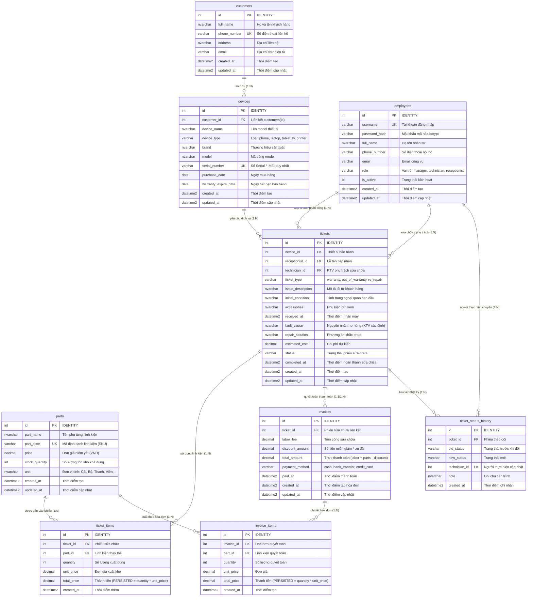

# 01. Sơ Đồ Quan Hệ Thực Thể (ERD) & Từ Điển Dữ Liệu

> **Hệ Quản Trị CSDL**: Microsoft SQL Server 2022 (Linux Docker Engine)  
> **Database Name**: `warranty_management`  
> **Collation**: `SQL_Latin1_General_CP1_CI_AS` (Hỗ trợ Unicode `NVARCHAR` cho Tiếng Việt)

---

## 1. Sơ Đồ Quan Hệ Thực Thể (Mermaid ERD)

---

## 2. Từ Điển Dữ Liệu Chi Tiết (Data Dictionary)

### 2.1. Bảng `customers` (Khách hàng)
Lưu trữ hồ sơ khách hàng gửi thiết bị đến trung tâm dịch vụ.

| Tên Cột | Kiểu Dữ Liệu | Nullable | Khóa / Ràng Buộc | Mô Tả Nghiệp Vụ |
| :--- | :--- | :--- | :--- | :--- |
| `id` | `INT` | NOT NULL | **PK**, IDENTITY(1,1) | Mã định danh duy nhất của khách hàng |
| `full_name` | `NVARCHAR(100)` | NOT NULL | - | Họ và tên đầy đủ |
| `phone_number` | `VARCHAR(20)` | NOT NULL | **UNIQUE**, INDEX | Số điện thoại duy nhất, dùng tra cứu và gửi mã |
| `address` | `NVARCHAR(255)` | NULL | - | Địa chỉ nơi ở hoặc công ty |
| `email` | `VARCHAR(100)` | NULL | - | Địa chỉ thư điện tử nhận hóa đơn điện tử |
| `created_at` | `DATETIME2` | NOT NULL | DEFAULT GETDATE() | Thời điểm tạo hồ sơ |
| `updated_at` | `DATETIME2` | NOT NULL | DEFAULT GETDATE() | Thời điểm chỉnh sửa gần nhất |

---

### 2.2. Bảng `employees` (Nhân sự & Phân quyền)
Lưu tài khoản nhân viên nội bộ quản trị hệ thống.

| Tên Cột | Kiểu Dữ Liệu | Nullable | Khóa / Ràng Buộc | Mô Tả Nghiệp Vụ |
| :--- | :--- | :--- | :--- | :--- |
| `id` | `INT` | NOT NULL | **PK**, IDENTITY(1,1) | Mã định danh nhân viên |
| `username` | `VARCHAR(50)` | NOT NULL | **UNIQUE** | Tên đăng nhập hệ thống |
| `password_hash` | `VARCHAR(255)` | NOT NULL | - | Mật khẩu hash chuẩn bcrypt |
| `full_name` | `NVARCHAR(100)` | NOT NULL | - | Họ tên đầy đủ của nhân sự |
| `phone_number` | `VARCHAR(20)` | NULL | - | Số điện thoại liên hệ nội bộ |
| `email` | `VARCHAR(100)` | NULL | - | Email công vụ |
| `role` | `VARCHAR(20)` | NOT NULL | CHECK (`role IN ('manager','technician','receptionist')`) | Vai trò: Quản lý, Kỹ thuật viên, Lễ tân |
| `is_active` | `BIT` | NOT NULL | DEFAULT 1, INDEX | 1: Đang hoạt động; 0: Đã khóa tài khoản |
| `created_at` | `DATETIME2` | NOT NULL | DEFAULT GETDATE() | Thời điểm tạo tài khoản |
| `updated_at` | `DATETIME2` | NOT NULL | DEFAULT GETDATE() | Thời điểm cập nhật trạng thái |

---

### 2.3. Bảng `devices` (Thiết bị)
Lưu trữ thông tin máy móc, thiết bị điện tử thuộc quyền sở hữu của khách hàng.

| Tên Cột | Kiểu Dữ Liệu | Nullable | Khóa / Ràng Buộc | Mô Tả Nghiệp Vụ |
| :--- | :--- | :--- | :--- | :--- |
| `id` | `INT` | NOT NULL | **PK**, IDENTITY(1,1) | Mã định danh thiết bị |
| `customer_id` | `INT` | NOT NULL | **FK** $\rightarrow$ `customers(id)` (CASCADE) | Mã khách hàng sở hữu |
| `device_name` | `NVARCHAR(150)` | NOT NULL | - | Tên thiết bị (VD: iPhone 13 Pro Max) |
| `device_type` | `VARCHAR(50)` | NULL | - | Loại: phone, laptop, tablet, tv, printer... |
| `brand` | `NVARCHAR(50)` | NULL | - | Hãng sản xuất (Apple, Samsung, Dell...) |
| `model` | `NVARCHAR(50)` | NULL | - | Ký hiệu model từ nhà sản xuất |
| `serial_number` | `VARCHAR(100)` | NULL | **UNIQUE INDEX** (chống trùng khi khác NULL) | Số Serial / IMEI duy nhất của máy |
| `purchase_date` | `DATE` | NULL | - | Ngày khách mua máy |
| `warranty_expire_date` | `DATE` | NULL | - | Ngày hết hạn bảo hành gốc |
| `created_at` | `DATETIME2` | NOT NULL | DEFAULT GETDATE() | Thời điểm tạo thiết bị |
| `updated_at` | `DATETIME2` | NOT NULL | DEFAULT GETDATE() | Thời điểm cập nhật |

---

### 2.4. Bảng `parts` (Kho linh kiện & Phụ tùng)
Quản lý tồn kho linh kiện thay thế, phụ tùng và giá niêm yết.

| Tên Cột | Kiểu Dữ Liệu | Nullable | Khóa / Ràng Buộc | Mô Tả Nghiệp Vụ |
| :--- | :--- | :--- | :--- | :--- |
| `id` | `INT` | NOT NULL | **PK**, IDENTITY(1,1) | Mã định danh linh kiện |
| `part_name` | `NVARCHAR(150)` | NOT NULL | INDEX | Tên phụ tùng (VD: Màn hình OLED, Pin 5000mAh) |
| `part_code` | `VARCHAR(50)` | NOT NULL | **UNIQUE** | Mã SKU phụ tùng (VD: LK-SCR-001) |
| `price` | `DECIMAL(18,2)` | NOT NULL | CHECK (`price >= 0`) | Đơn giá niêm yết bán ra (VNĐ) |
| `stock_quantity` | `INT` | NOT NULL | DEFAULT 0, CHECK (`stock_quantity >= 0`), INDEX | Số lượng còn lại trong kho |
| `unit` | `NVARCHAR(20)` | NOT NULL | DEFAULT N'Cái' | Đơn vị tính (Cái, Bộ, Viên, Cây...) |
| `created_at` | `DATETIME2` | NOT NULL | DEFAULT GETDATE() | Ngày nhập kho lần đầu |
| `updated_at` | `DATETIME2` | NOT NULL | DEFAULT GETDATE() | Ngày cập nhật tồn kho gần nhất |

---

### 2.5. Bảng `tickets` (Phiếu dịch vụ & sửa chữa)
Thực thể trung tâm điều phối toàn bộ vòng đời tiếp nhận, chẩn đoán, sửa chữa và bàn giao.

| Tên Cột | Kiểu Dữ Liệu | Nullable | Khóa / Ràng Buộc | Mô Tả Nghiệp Vụ |
| :--- | :--- | :--- | :--- | :--- |
| `id` | `INT` | NOT NULL | **PK**, IDENTITY(1,1) | Mã số phiếu sửa chữa |
| `device_id` | `INT` | NOT NULL | **FK** $\rightarrow$ `devices(id)` | Thiết bị cần xử lý |
| `receptionist_id` | `INT` | NOT NULL | **FK** $\rightarrow$ `employees(id)` | Lễ tân lập phiếu tiếp nhận |
| `technician_id` | `INT` | NULL | **FK** $\rightarrow$ `employees(id)` | Kỹ thuật viên phụ trách sửa chữa |
| `ticket_type` | `VARCHAR(20)` | NOT NULL | CHECK (`ticket_type IN ('warranty','out_of_warranty','re_repair')`) | Loại dịch vụ: Bảo hành hãng, Dịch vụ tính phí, Sửa lại |
| `issue_description` | `NVARCHAR(MAX)` | NOT NULL | - | Mô tả hiện tượng lỗi từ khách hàng |
| `initial_condition` | `NVARCHAR(500)` | NULL | - | Tình trạng ngoại quan khi nhận máy |
| `accessories` | `NVARCHAR(255)` | NULL | - | Phụ kiện mang kèm (sạc, cáp, hộp...) |
| `received_at` | `DATETIME2` | NOT NULL | DEFAULT GETDATE(), INDEX | Thời điểm nhận máy |
| `fault_cause` | `NVARCHAR(MAX)` | NULL | - | Nguyên nhân hư hỏng sau khi chẩn đoán |
| `repair_solution` | `NVARCHAR(MAX)` | NULL | - | Phương án kỹ thuật xử lý |
| `estimated_cost` | `DECIMAL(18,2)` | NOT NULL | DEFAULT 0, CHECK (`estimated_cost >= 0`) | Chi phí dự kiến báo khách |
| `status` | `VARCHAR(20)` | NOT NULL | DEFAULT 'received', CHECK (`status IN ('received','assigned','diagnosing','waiting_parts','repaired','completed','paid','delivered','cancelled')`) | Trạng thái phiếu sửa chữa |
| `completed_at` | `DATETIME2` | NULL | - | Thời điểm KTV bấm hoàn tất |
| `created_at` | `DATETIME2` | NOT NULL | DEFAULT GETDATE() | Thời điểm tạo bản ghi |
| `updated_at` | `DATETIME2` | NOT NULL | DEFAULT GETDATE() | Thời điểm cập nhật bản ghi |

---

### 2.6. Bảng `ticket_items` (Linh kiện xuất vào phiếu sửa chữa)
Ghi nhận linh kiện mà Kỹ thuật viên xuất từ kho để lắp ráp vào máy của khách trong quá trình sửa.

| Tên Cột | Kiểu Dữ Liệu | Nullable | Khóa / Ràng Buộc | Mô Tả Nghiệp Vụ |
| :--- | :--- | :--- | :--- | :--- |
| `id` | `INT` | NOT NULL | **PK**, IDENTITY(1,1) | Mã dòng linh kiện gắn vào phiếu |
| `ticket_id` | `INT` | NOT NULL | **FK** $\rightarrow$ `tickets(id)` (CASCADE) | Phiếu sửa chữa liên kết |
| `part_id` | `INT` | NOT NULL | **FK** $\rightarrow$ `parts(id)` (NO ACTION) | Linh kiện xuất kho |
| `quantity` | `INT` | NOT NULL | CHECK (`quantity > 0`) | Số lượng linh kiện xuất dùng |
| `unit_price` | `DECIMAL(18,2)` | NOT NULL | CHECK (`unit_price >= 0`) | Đơn giá xuất linh kiện tại thời điểm làm |
| `total_price` | `DECIMAL(18,2)` | NOT NULL | **AS (`quantity` * `unit_price`) PERSISTED** | Thành tiền (cột tính toán tự động lưu vật lý) |
| `created_at` | `DATETIME2` | NOT NULL | DEFAULT GETDATE() | Thời điểm xuất kho linh kiện |

---

### 2.7. Bảng `invoices` (Hóa đơn thanh toán)
Lưu trữ chứng từ tài chính khi thu ngân quyết toán và trả máy cho khách hàng.

| Tên Cột | Kiểu Dữ Liệu | Nullable | Khóa / Ràng Buộc | Mô Tả Nghiệp Vụ |
| :--- | :--- | :--- | :--- | :--- |
| `id` | `INT` | NOT NULL | **PK**, IDENTITY(1,1) | Mã số hóa đơn |
| `ticket_id` | `INT` | NOT NULL | **FK** $\rightarrow$ `tickets(id)` (NO ACTION), INDEX | Phiếu sửa chữa được quyết toán |
| `labor_fee` | `DECIMAL(18,2)` | NOT NULL | DEFAULT 0, CHECK (`labor_fee >= 0`) | Tiền công kỹ thuật |
| `discount_amount`| `DECIMAL(18,2)` | NOT NULL | DEFAULT 0, CHECK (`discount_amount >= 0`)| Số tiền chiết khấu / miễn trừ bảo hành |
| `total_amount` | `DECIMAL(18,2)` | NOT NULL | CHECK (`total_amount >= 0`) | Thực thu từ khách |
| `payment_method` | `VARCHAR(30)` | NOT NULL | DEFAULT 'cash', CHECK (`payment_method IN ('cash','bank_transfer','credit_card')`) | Hình thức: Tiền mặt, Chuyển khoản, Thẻ |
| `paid_at` | `DATETIME2` | NULL | - | Thời điểm thu tiền thành công |
| `created_at` | `DATETIME2` | NOT NULL | DEFAULT GETDATE(), INDEX | Ngày tạo hóa đơn |
| `updated_at` | `DATETIME2` | NOT NULL | DEFAULT GETDATE() | Ngày cập nhật |

---

### 2.8. Bảng `invoice_items` (Chi tiết linh kiện trên hóa đơn)
Lưu chi tiết các linh kiện được quyết toán tài chính trên hóa đơn (được copy từ `ticket_items` sang khi thanh toán).

| Tên Cột | Kiểu Dữ Liệu | Nullable | Khóa / Ràng Buộc | Mô Tả Nghiệp Vụ |
| :--- | :--- | :--- | :--- | :--- |
| `id` | `INT` | NOT NULL | **PK**, IDENTITY(1,1) | Mã dòng chi tiết hóa đơn |
| `invoice_id` | `INT` | NOT NULL | **FK** $\rightarrow$ `invoices(id)` (CASCADE) | Hóa đơn liên kết |
| `part_id` | `INT` | NOT NULL | **FK** $\rightarrow$ `parts(id)` (NO ACTION) | Linh kiện thanh toán |
| `quantity` | `INT` | NOT NULL | CHECK (`quantity > 0`) | Số lượng tính tiền |
| `unit_price` | `DECIMAL(18,2)` | NOT NULL | CHECK (`unit_price >= 0`) | Đơn giá xuất hóa đơn |
| `total_price` | `DECIMAL(18,2)` | NOT NULL | **AS (`quantity` * `unit_price`) PERSISTED** | Thành tiền lưu vật lý |
| `created_at` | `DATETIME2` | NOT NULL | DEFAULT GETDATE() | Ngày tạo |

---

### 2.9. Bảng `ticket_status_history` (Nhật ký trạng thái phiếu)
Bảng Audit Log lưu lại toàn bộ tiến trình lịch sử thay đổi trạng thái của phiếu (được ghi tự động bằng Trigger).

| Tên Cột | Kiểu Dữ Liệu | Nullable | Khóa / Ràng Buộc | Mô Tả Nghiệp Vụ |
| :--- | :--- | :--- | :--- | :--- |
| `id` | `INT` | NOT NULL | **PK**, IDENTITY(1,1) | Mã dòng nhật ký |
| `ticket_id` | `INT` | NOT NULL | **FK** $\rightarrow$ `tickets(id)` (CASCADE), INDEX | Phiếu được chuyển trạng thái |
| `old_status` | `VARCHAR(20)` | NULL | - | Trạng thái trước khi đổi |
| `new_status` | `VARCHAR(20)` | NOT NULL | - | Trạng thái mới cập nhật |
| `technician_id` | `INT` | NULL | **FK** $\rightarrow$ `employees(id)` | Người thực hiện thao tác |
| `note` | `NVARCHAR(500)` | NULL | - | Ghi chú hoặc lý do chuyển trạng thái |
| `created_at` | `DATETIME2` | NOT NULL | DEFAULT GETDATE() | Thời điểm ghi nhận vết |

---

## 3. Chiến Lược Đánh Chỉ Mục (Index Design Strategy)

1. **Chỉ mục tìm kiếm nhanh qua số điện thoại (`ix_customers_phone_number`)**:
   - `CREATE INDEX ix_customers_phone_number ON customers(phone_number);`
   - Phục vụ tra cứu khách hàng tại quầy tiếp nhận POS chỉ trong $O(1)$.
2. **Chỉ mục duy nhất có điều kiện trên Serial Number (`uq_devices_serial_number`)**:
   - `CREATE UNIQUE NONCLUSTERED INDEX uq_devices_serial_number ON devices(serial_number) WHERE serial_number IS NOT NULL;`
   - Đảm bảo mỗi Serial máy là duy nhất, nhưng vẫn cho phép các thiết bị không có serial (phụ kiện, máy cũ mất tem) lưu `NULL`.
3. **Chỉ mục kết hợp phân trang & lọc phiếu (`ix_tickets_status_received_at`)**:
   - `CREATE INDEX ix_tickets_status_received_at ON tickets(status, received_at DESC);`
   - Tối ưu hóa truy vấn lọc phiếu theo trạng thái và sắp xếp thời gian giảm dần mà không cần Memory Sort.
