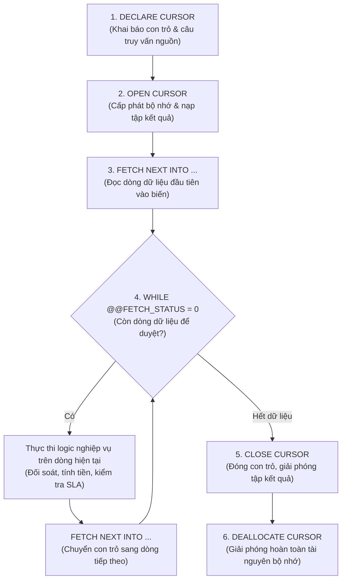

# 03. Cơ Chế Con Trỏ (Database Cursor) Trong SQL Server

> **Hệ Quản Trị CSDL**: Microsoft SQL Server 2022  
> **Kỹ Thuật**: `CURSOR LOCAL FAST_FORWARD`  
> **Ứng Dụng Trong Hệ Thống**: Đối soát toàn vẹn doanh thu tài chính & Rà soát cảnh báo vi phạm cam kết thời gian dịch vụ (SLA Alerting).

---

## 1. Giới Thiệu Về Database Cursor

Trong SQL Server, **Cursor (Con trỏ)** là cơ chế cho phép duyệt qua từng bản ghi (`Row-by-Row processing`) từ một tập kết quả truy vấn (`Result Set`). 

Mặc dù trong hầu hết các tác vụ CRUD thông thường, truy vấn theo tập hợp (`Set-based Operations`) được ưu tiên nhờ tốc độ cao, nhưng **Cursor** là giải pháp bắt buộc và tối ưu trong các bài toán:
1. **Kiểm toán & Đối soát tuần tự (Sequential Auditing)**: Khi cần kiểm tra chéo nhiều bảng, tính toán lại tổng tiền từ công thợ và các dòng phụ tùng, phát hiện sai lệch và thực thi lệnh cập nhật sửa sai có điều kiện trên từng bản ghi riêng biệt.
2. **Cảnh báo nghiệp vụ nâng cao (Workflow Alerting & Notifications)**: Khi cần duyệt danh sách các phiếu trễ hạn, tính số ngày vượt quá SLA và đổ dữ liệu ra bảng tạm phục vụ thông báo cho Dashboard.

---

## 2. Vòng Đời Chuẩn Của Một Cursor Trong SQL Server



---

## 3. Chi Tiết Các Thủ Tục Ứng Dụng Cursor

### 3.1. Thủ tục `dbo.sp_audit_invoices`: Đối soát tài chính & Tự động sửa sai

#### Mục đích:
Rà soát toàn bộ hóa đơn trong CSDL để đảm bảo:
$$\text{total\_amount} = \text{labor\_fee} + \sum(\text{unit\_price} \times \text{quantity}) - \text{discount\_amount}$$
Nếu phát hiện hóa đơn nào có số tiền lưu trữ (`stored_total`) khác với số tiền tính toán thực tế (`calculated_total`), hệ thống sẽ ghi nhận số lượng lỗi và có tùy chọn tự động cập nhật lại (`@auto_fix = 1`).

#### Mã nguồn T-SQL chi tiết:
```sql
CREATE OR ALTER PROCEDURE dbo.sp_audit_invoices
    @auto_fix BIT = 0
AS
BEGIN
    SET NOCOUNT ON;
    DECLARE @inv_id INT, 
            @labor DECIMAL(18,2), 
            @discount DECIMAL(18,2), 
            @stored_total DECIMAL(18,2), 
            @calculated_total DECIMAL(18,2);
    DECLARE @error_count INT = 0;

    -- Khai báo con trỏ duyệt qua toàn bộ hóa đơn
    DECLARE cur_invoices CURSOR LOCAL FAST_FORWARD FOR
        SELECT id, labor_fee, discount_amount, total_amount 
        FROM invoices 
        ORDER BY id;

    -- Mở con trỏ
    OPEN cur_invoices;
    FETCH NEXT FROM cur_invoices INTO @inv_id, @labor, @discount, @stored_total;

    -- Vòng lặp duyệt từng dòng hóa đơn
    WHILE @@FETCH_STATUS = 0
    BEGIN
        -- Tính toán lại tổng tiền chuẩn từ hàm UDF fn_calculate_parts_total
        SET @calculated_total = @labor + dbo.fn_calculate_parts_total(@inv_id) - @discount;
        IF @calculated_total < 0 SET @calculated_total = 0;

        -- Đối chiếu dữ liệu thực tế và dữ liệu đã lưu
        IF @calculated_total <> @stored_total
        BEGIN
            SET @error_count += 1;
            
            -- Tự động sửa lỗi nếu tham số @auto_fix = 1
            IF @auto_fix = 1
                UPDATE invoices 
                SET total_amount = @calculated_total, 
                    updated_at = GETDATE() 
                WHERE id = @inv_id;
        END

        -- Chuyển sang hóa đơn tiếp theo
        FETCH NEXT FROM cur_invoices INTO @inv_id, @labor, @discount, @stored_total;
    END

    -- Đóng và giải phóng con trỏ để tránh rò rỉ bộ nhớ
    CLOSE cur_invoices;
    DEALLOCATE cur_invoices;

    -- Trả về báo cáo kết quả kiểm toán
    SELECT @error_count AS discrepancies_found, @auto_fix AS was_auto_fixed;
END;
GO
```

---

### 3.2. Thủ tục `dbo.sp_alert_delayed_tickets`: Rà soát vi phạm SLA tiến độ

#### Mục đích:
Duyệt qua các phiếu bảo hành chưa hoàn tất (`status NOT IN ('completed', 'delivered', 'cancelled')`) mà có số ngày tiếp nhận vượt quá ngưỡng quy định (`@delay_days`, mặc định 14 ngày). Cursor trích xuất chi tiết từng phiếu trễ hạn, tính toán thời gian chậm trễ và xuất ra danh sách cảnh báo cho Quản lý.

#### Mã nguồn T-SQL chi tiết:
```sql
CREATE OR ALTER PROCEDURE dbo.sp_alert_delayed_tickets
    @delay_days INT = 14
AS
BEGIN
    SET NOCOUNT ON;

    -- Bảng tạm lưu trữ danh sách cảnh báo
    DECLARE @delayed_tickets TABLE (
        ticket_id INT,
        customer_name NVARCHAR(100),
        phone_number VARCHAR(20),
        device_name NVARCHAR(100),
        status VARCHAR(30),
        overdue_days INT,
        assigned_technician NVARCHAR(100)
    );

    DECLARE @t_id INT, 
            @c_name NVARCHAR(100), 
            @phone VARCHAR(20),
            @d_name NVARCHAR(100), 
            @st VARCHAR(30), 
            @days INT, 
            @tech NVARCHAR(100);

    -- Khai báo con trỏ lọc các phiếu trễ hạn
    DECLARE cur_delayed_tickets CURSOR LOCAL FAST_FORWARD FOR
        SELECT t.id AS ticket_id,
               c.full_name AS customer_name,
               c.phone_number,
               d.device_name,
               t.status,
               DATEDIFF(DAY, t.received_at, GETDATE()) AS overdue_days,
               tech.full_name AS assigned_technician
        FROM tickets t
        JOIN devices d ON d.id = t.device_id
        JOIN customers c ON c.id = d.customer_id
        LEFT JOIN employees tech ON tech.id = t.technician_id
        WHERE t.status NOT IN ('completed', 'delivered', 'cancelled')
          AND DATEDIFF(DAY, t.received_at, GETDATE()) > @delay_days
        ORDER BY t.received_at ASC;

    OPEN cur_delayed_tickets;
    FETCH NEXT FROM cur_delayed_tickets INTO @t_id, @c_name, @phone, @d_name, @st, @days, @tech;

    WHILE @@FETCH_STATUS = 0
    BEGIN
        -- Ghi từng dòng trễ hạn vào bảng kết quả cảnh báo
        INSERT INTO @delayed_tickets (ticket_id, customer_name, phone_number, device_name, status, overdue_days, assigned_technician)
        VALUES (@t_id, @c_name, @phone, @d_name, @st, @days, @tech);

        FETCH NEXT FROM cur_delayed_tickets INTO @t_id, @c_name, @phone, @d_name, @st, @days, @tech;
    END

    CLOSE cur_delayed_tickets;
    DEALLOCATE cur_delayed_tickets;

    -- Trả về bảng danh sách cảnh báo sắp xếp theo số ngày quá hạn giảm dần
    SELECT * FROM @delayed_tickets ORDER BY overdue_days DESC;
END;
GO
```

---

## 4. Tối Ưu Hóa & Best Practices Với Cursor

Để đảm bảo Cursor hoạt động an toàn và không gây treo server trong môi trường Production:

1. **Bắt buộc sử dụng tùy chọn `LOCAL FAST_FORWARD`**:
   - `LOCAL`: Giới hạn phạm vi của con trỏ trong phiên thực thi (scope) của stored procedure, tự động giải phóng khi procedure kết thúc.
   - `FAST_FORWARD`: Chỉ thị cho SQL Server tối ưu hóa con trỏ theo kiểu **Forward-Only (chỉ tiến)** và **Read-Only (chỉ đọc)**. Đây là kiểu con trỏ có tốc độ nhanh nhất và tốn ít tài nguyên RAM/TempDB nhất trong SQL Server.
2. **Luôn đi kèm cặp lệnh `CLOSE` và `DEALLOCATE`**:
   - `CLOSE`: Đóng tập kết quả và giải phóng các khóa dòng (locks).
   - `DEALLOCATE`: Xóa bỏ hoàn toàn định nghĩa con trỏ khỏi bộ nhớ hệ thống.
3. **Sử dụng `@@FETCH_STATUS = 0`**:
   - Giá trị `0`: Đọc dòng dữ liệu thành công.
   - Giá trị `-1`: Con trỏ đã vượt qua dòng cuối cùng (kết thúc tập dữ liệu).
   - Giá trị `-2`: Dòng dữ liệu bị xóa bởi tiến trình khác trong lúc con trỏ đang chạy.
