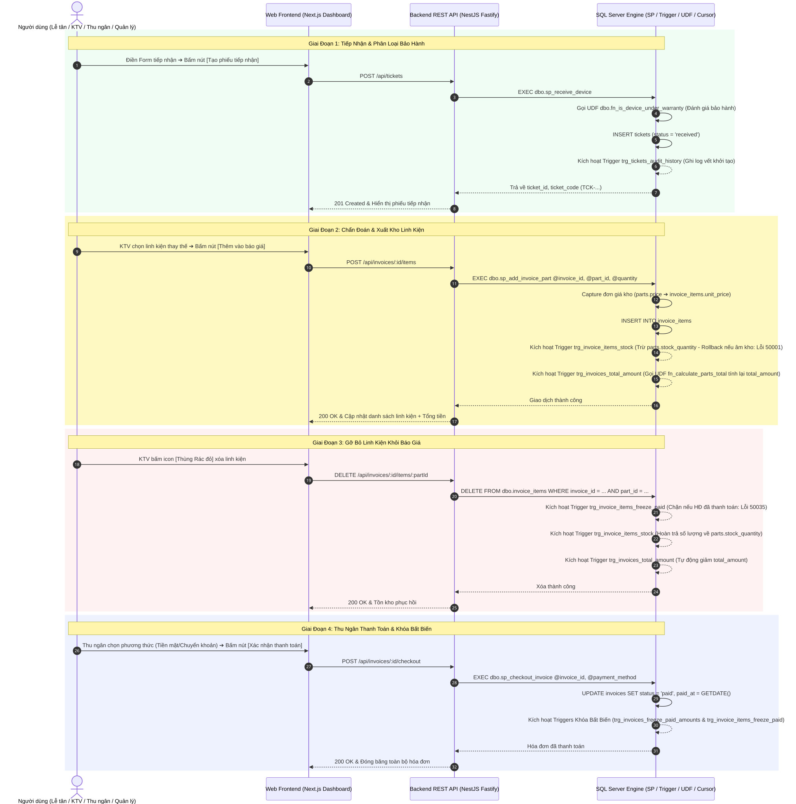
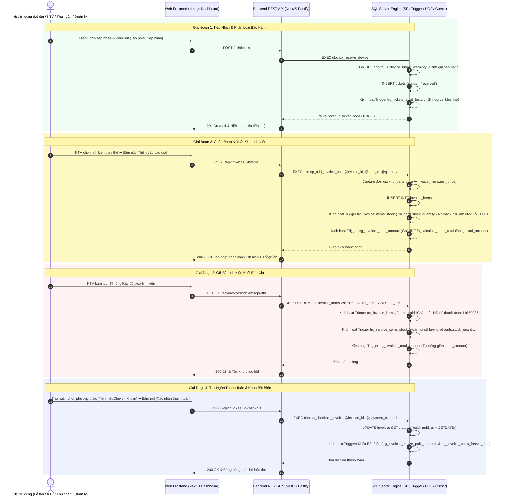

# Sổ Tay Kỹ Thuật: Ánh Xạ Chi Tiết Thao Tác Dashboard Đến Database Engine

> **Dự án**: UIT CARE — Hệ Thống Quản Lý Bảo Hành & Sửa Chữa Thiết Bị  
> **Nguyên tắc cốt lõi**: "Zero-Trust Data Integrity" — Toàn bộ quy tắc kho vận, phân loại bảo hành, state machine và khóa tài chính đều được thực thi tự động và bảo vệ tuyệt đối ở tầng CSDL (Microsoft SQL Server Engine).

---

## 1. Sơ Đồ Toàn Cảnh Luồng Tương Tác UI ⟷ DB Engine

### 1.1 Sơ Đồ Trực Quan (Vector Visual Diagram)



---

### 1.2 Mã Nguồn Sơ Đồ Mermaid (Mermaid Source Code)



---

## 2. Phân Nhóm 1: Gom Theo Database Triggers (7 Triggers)

| Tên Trigger | Bảng Tác Động | Sự Kiện | Thao Tác Chi Tiết Trên UI & Trường Dữ Liệu (`UI Label` ⟷ `db_field`) | URL Trực Quan (Giao Diện) | Cơ Chế Kiểm Soát Tự Động & Ràng Buộc | Mã Lỗi Rollback |
|:---|:---|:---:|:---|:---|:---|:---:|
| **`trg_invoice_items_stock`** | `invoice_items` | `INSERT`<br/>`UPDATE`<br/>`DELETE` | • **Thêm linh kiện (`INSERT`)**: Tại chi tiết phiếu sửa, bấm nút **`[+ Thêm linh kiện]`** $\rightarrow$ chọn dropdown **`[Linh kiện kho]`** (`invoice_items.part_id`) và nhập ô **`[Số lượng]`** (`invoice_items.quantity`) $\rightarrow$ bấm **`[Thêm]`**.<br/>• **Sửa số lượng (`UPDATE`)**: Thay đổi giá trị ô **`[Số lượng]`** (`quantity`).<br/>• **Xóa linh kiện (`DELETE`)**: Bấm icon **`[Thùng rác đỏ]`** xóa dòng linh kiện khỏi hóa đơn. | [Bàn kỹ thuật: `http://localhost:3000/technician`](http://localhost:3000/technician) | • Tự động trừ/cộng tồn kho **`[Tồn kho]`** (`parts.stock_quantity`)<br/>• Tự tính delta chênh lệch kho khi sửa số lượng<br/>• Tự hoàn trả linh kiện về kho khi xóa dòng<br/>• Hủy bỏ toàn bộ giao dịch nếu tồn kho bị âm | **`50001`** *(Kho không đủ số lượng)* |
| **`trg_invoices_total_amount`** | `invoice_items` | `INSERT`<br/>`UPDATE`<br/>`DELETE` | Bất kỳ thao tác bấm nút **`[+ Thêm linh kiện]`**, sửa ô **`[Số lượng]`** (`quantity`), hoặc bấm icon **`[Thùng rác đỏ]`** xóa dòng linh kiện trong hóa đơn | [Thu ngân: `http://localhost:3000/cashier`](http://localhost:3000/cashier)<br/>[Bàn kỹ thuật: `http://localhost:3000/technician`](http://localhost:3000/technician) | Tự động tính toán lại cột **`[Tổng tiền thanh toán]`** (`invoices.total_amount`) bằng cách gọi Scalar Function `dbo.fn_calculate_parts_total(invoice_id)` | — |
| **`trg_invoices_labor_update`** | `invoices` | `INSERT`<br/>`UPDATE` | Tại tab *Hóa đơn & Báo giá*, Lễ tân / KTV chỉnh sửa ô nhập **`[Tiền công dịch vụ]`** (`invoices.labor_fee`) hoặc ô **`[Chiết khấu]`** (`invoices.discount_amount`) $\rightarrow$ bấm nút **`[Cập nhật báo giá]`** | [Thu ngân: `http://localhost:3000/cashier`](http://localhost:3000/cashier)<br/>[Bàn kỹ thuật: `http://localhost:3000/technician`](http://localhost:3000/technician) | Tự động tính lại **`[Tổng tiền thanh toán]`** (`invoices.total_amount`):<br/>`total_amount = MAX(0, labor_fee - discount_amount) + linh_kien` | — |
| **`trg_tickets_workflow_guard`** | `tickets` | `INSERT`<br/>`UPDATE` | • **Chuyển tiến độ**: KTV chọn dropdown **`[Trạng thái]`** (`tickets.status`) sang *Đang kiểm tra* (`inspecting`), *Chờ linh kiện* (`waiting_for_parts`), *Đang sửa chữa* (`repairing`), hoặc *Hoàn tất sửa chữa* (`completed`). Bắt buộc phải chọn dropdown **`[Kỹ thuật viên phụ trách]`** (`tickets.technician_id`).<br/>• **Bàn giao máy**: Lễ tân bấm nút **`[Bàn giao máy]`** để chuyển `status` sang *Đã giao trả khách* (`delivered`). | [Bàn kỹ thuật: `http://localhost:3000/technician`](http://localhost:3000/technician)<br/>[Tiếp nhận: `http://localhost:3000/reception`](http://localhost:3000/reception) | • Bắt buộc `technician_id IS NOT NULL` khi sang trạng thái kỹ thuật (chặn nếu thiếu)<br/>• Ngăn nhảy cóc sang `delivered` khi chưa qua `completed`<br/>• Cấm mở lại phiếu đã bàn giao (`delivered`)<br/>• Tự động điền trường **`[Thời gian hoàn tất]`** (`completed_at = GETDATE()`) | **`50003`** *(Thiếu KTV phụ trách)*<br/>**`50004`** *(Sai luồng tiến trình)* |
| **`trg_tickets_audit_history`** | `tickets` | `INSERT`<br/>`UPDATE` | Bất kỳ thao tác bấm nút **`[Tạo phiếu tiếp nhận]`** hoặc bấm **`[Cập nhật tiến độ]`** làm thay đổi dropdown **`[Trạng thái]`** (`tickets.status`) | [Danh sách phiếu: `http://localhost:3000/tickets`](http://localhost:3000/tickets)<br/>[Tiếp nhận: `http://localhost:3000/reception`](http://localhost:3000/reception) | Tự động chèn 1 bản ghi vào bảng `ticket_status_history`: ghi nhận **`[Mã phiếu]`** (`ticket_id`), **`[Trạng thái cũ]`** (`old_status`), **`[Trạng thái mới]`** (`new_status`), **`[KTV]`** (`technician_id`), **`[Mốc thời gian]`** (`created_at`) | — |
| **`trg_invoice_items_freeze_paid`** | `invoice_items` | `INSERT`<br/>`UPDATE`<br/>`DELETE` | Tại quầy thu ngân, sau khi bấm nút **`[$ Thanh toán]`** chuyển badge sang **`[Đã thu tiền]`** (`invoices.status = 'paid'`), người dùng cố tình gửi lệnh thêm mới, đổi số lượng hoặc xóa dòng linh kiện (`invoice_items`) | [Thu ngân: `http://localhost:3000/cashier`](http://localhost:3000/cashier) | **Khóa tài chính cấp dòng**: Kiểm tra `invoices.status = 'paid'`, hủy toàn bộ giao dịch và cấm sửa đổi bảng kê linh kiện một khi hóa đơn đã quyết toán | **`50035`** *(Hóa đơn đã thanh toán)* |
| **`trg_invoices_freeze_paid_amounts`** | `invoices` | `UPDATE` | Khi hóa đơn đã mang badge **`[Đã thu tiền]`** (`status = 'paid'`), người dùng cố tình sửa các ô **`[Tiền công]`** (`labor_fee`), **`[Chiết khấu]`** (`discount_amount`), **`[Tổng tiền]`** (`total_amount`), hoặc sửa dropdown **`[Trạng thái]`** ngược về **`[Chưa thanh toán]`** (`unpaid`) | [Thu ngân: `http://localhost:3000/cashier`](http://localhost:3000/cashier) | **Khóa tài chính cấp hóa đơn**: Đóng băng bất biến toàn bộ số tiền thanh toán và cấm hoàn tác trạng thái thanh toán | **`50036`** *(Hóa đơn đã thanh toán)* |

---

## 3. Phân Nhóm 2: Gom Theo Database Cursors (2 Con Trỏ T-SQL)

| Tên Cursor | Nằm Trong Thủ Tục | Màn Hình / Thao Tác Trên UI | URL Trực Quan (Giao Diện) | Cơ Chế Duyệt Con Trỏ & Mục Đích Nghiệp Vụ |
|:---|:---|:---|:---|:---|
| **`cur_delayed_tickets`** | `dbo.sp_alert_delayed_tickets` | **Dashboard Giám Đốc**: Mở trang hoặc bấm nút **"Làm mới"** $\rightarrow$ Widget *"Phiếu quá hạn SLA (>14 ngày)"* | [Dashboard: `http://localhost:3000/dashboard`](http://localhost:3000/dashboard) | Con trỏ duyệt tuần tự qua từng phiếu đang mở quá hạn SLA (>14 ngày), JOIN thông tin khách hàng, thiết bị và KTV phụ trách, tính chính xác số ngày trễ nạp vào dataset cho Dashboard hiển thị cảnh báo đỏ. |
| **`cur_invoices`** | `dbo.sp_audit_invoices` | **Dashboard Giám Đốc**: Bấm nút **"Đối soát hóa đơn & Doanh thu"** $\rightarrow$ Bấm **"Bắt đầu quét đối soát"** | [Dashboard: `http://localhost:3000/dashboard`](http://localhost:3000/dashboard) | Con trỏ duyệt qua 100% hóa đơn trong CSDL, gọi hàm `fn_calculate_parts_total` để so khớp tổng tiền thực tế với `total_amount`. Nếu bật `auto_fix = 1`, con trỏ tự động sửa đúng số tiền cho từng hóa đơn bị lệch. |

---

## 4. Phân Nhóm 3: Gom Theo User-Defined Functions (3 Functions)

| Tên Function | Loại Hàm | Màn Hình / Vị Trí Gọi Trên Dashboard | URL Trực Quan (Giao Diện) | Kết Quả Trả Về & Ứng Dụng Thực Tế |
|:---|:---:|:---|:---|:---|
| **`dbo.fn_calculate_parts_total`** | Scalar | Gọi ngầm trong Triggers `trg_invoices_total_amount`, `trg_invoices_labor_update` và Stored Procedure `sp_audit_invoices` | [Thu ngân: `http://localhost:3000/cashier`](http://localhost:3000/cashier)<br/>[Bàn kỹ thuật: `http://localhost:3000/technician`](http://localhost:3000/technician) | Trả về tổng tiền linh kiện: $\sum(\text{quantity} \times \text{unit\_price})$ dạng `DECIMAL(18,2)`. |
| **`dbo.fn_is_device_under_warranty`** | Scalar | • **Màn hình Tiếp nhận**: Khi tạo phiếu mới<br/>• **Màn hình Tra cứu**: Khách tra cứu thiết bị | [Tiếp nhận: `http://localhost:3000/reception`](http://localhost:3000/reception)<br/>[Tra cứu: `http://localhost:3000/tra-cuu`](http://localhost:3000/tra-cuu) | Trả về `1` (Còn bảo hành) hoặc `0` (Hết hạn). Tự động phân loại `warranty` (miễn phí) hay `repair` (tính phí); hiển thị badge xanh/vàng. |
| **`dbo.fn_get_device_repair_history`** | Table-Valued | • **Màn hình Tra cứu**<br/>• **Modal Chi tiết máy** | [Tra cứu: `http://localhost:3000/tra-cuu`](http://localhost:3000/tra-cuu)<br/>[Phiếu sửa: `http://localhost:3000/tickets`](http://localhost:3000/tickets) | Trả về bảng lịch sử sửa chữa đa tầng: Ngày nhận, mã phiếu, lỗi, linh kiện đã thay, KTV thực hiện và kết quả bàn giao. |

---

## 5. Phân Nhóm 4: Gom Theo Stored Procedures (11 Thủ Tục & Tác Vụ CSDL)

### 5.1 Bảng Tổng Hợp 11 Stored Procedures & Tác Vụ CSDL

| Stored Procedure | Màn Hình / Nút Bấm Trên UI | URL Trực Quan (Giao Diện) | Nghiệp Vụ Thực Thi Nguyên Tử (ACID) |
|:---|:---|:---|:---|
| **`dbo.sp_receive_device`** | Phân hệ Lễ tân $\rightarrow$ Bấm **"Tạo phiếu tiếp nhận"** | [Tiếp nhận: `http://localhost:3000/reception`](http://localhost:3000/reception) | Tạo khách $\rightarrow$ Tạo/cập nhật máy $\rightarrow$ Gọi hàm bảo hành $\rightarrow$ Tạo phiếu `received` $\rightarrow$ Kích hoạt trigger ghi audit. |
| **`dbo.sp_process_ticket`** | Bàn làm việc KTV $\rightarrow$ Bấm **"Cập nhật tiến độ"** | [Bàn kỹ thuật: `http://localhost:3000/technician`](http://localhost:3000/technician) | Cập nhật trạng thái phiếu $\rightarrow$ Ghi nguyên nhân/giải pháp $\rightarrow$ Kích hoạt trigger kiểm tra KTV & tự điền `completed_at`. |
| **`dbo.sp_create_invoice`** | Màn hình Hóa đơn / KTV $\rightarrow$ Khởi tạo hóa đơn báo giá | [Bàn kỹ thuật: `http://localhost:3000/technician`](http://localhost:3000/technician)<br/>[Thu ngân: `http://localhost:3000/cashier`](http://localhost:3000/cashier) | Tạo hóa đơn cho phiếu $\rightarrow$ Gán tiền công & chiết khấu $\rightarrow$ Kích hoạt trigger tính tổng tiền. |
| **`dbo.sp_add_invoice_part`** | Modal Chẩn đoán $\rightarrow$ Chọn linh kiện kho $\rightarrow$ Bấm **"Thêm vào báo giá"** | [Bàn kỹ thuật: `http://localhost:3000/technician`](http://localhost:3000/technician) | Capture giá kho bất biến $\rightarrow$ Gán vào `invoice_items` $\rightarrow$ Kích hoạt trigger trừ kho & trigger tính lại tổng tiền. |
| **`dbo.sp_checkout_invoice`** | Phân hệ Thu ngân $\rightarrow$ Bấm **"Xác nhận thanh toán"** | [Thu ngân: `http://localhost:3000/cashier`](http://localhost:3000/cashier) | Ghi nhận hình thức thanh toán $\rightarrow$ Gán `paid_at` $\rightarrow$ Đổi sang `paid` $\rightarrow$ Kích hoạt bộ đôi trigger khóa bất biến. |
| **`dbo.sp_alert_delayed_tickets`** | Dashboard Giám đốc $\rightarrow$ Widget Cảnh báo trễ SLA | [Dashboard: `http://localhost:3000/dashboard`](http://localhost:3000/dashboard) | Sử dụng **Cursor `cur_delayed_tickets`** duyệt tìm các phiếu quá hạn > 14 ngày, trả về danh sách cảnh báo. |
| **`dbo.sp_audit_invoices`** | Dashboard Giám đốc $\rightarrow$ Modal Đối soát doanh thu | [Dashboard: `http://localhost:3000/dashboard`](http://localhost:3000/dashboard) | Sử dụng **Cursor `cur_invoices`** duyệt đối soát 100% hóa đơn, tự động sửa sai số nếu bật `@auto_fix = 1`. |
| **`dbo.sp_backup_database`** | Quản trị CSDL $\rightarrow$ Bấm **"Tạo bản sao lưu ngay (.BAK)"** | [Quản trị CSDL: `http://localhost:3000/database`](http://localhost:3000/database) | Database Engine tạo snapshot vật lý nguyên khối nén ra file `.bak` trên ổ đĩa. |
| **`master.dbo.sp_restore_database`** | Quản trị CSDL $\rightarrow$ Bấm **"Khôi phục CSDL"** | [Quản trị CSDL: `http://localhost:3000/database`](http://localhost:3000/database) | Đưa CSDL về `SINGLE_USER`, khôi phục đè từ `.bak`, đưa lại `MULTI_USER`. |
| **`dbo.sp_bulk_import_parts`** | Kho linh kiện / Quản trị CSDL $\rightarrow$ Bấm **"Nhập CSV (Bulk)"** | [Kho linh kiện: `http://localhost:3000/inventory`](http://localhost:3000/inventory)<br/>[Quản trị CSDL: `http://localhost:3000/database`](http://localhost:3000/database) | Thực thi `BULK INSERT` nạp file CSV siêu tốc và `MERGE` cộng dồn tồn kho linh kiện. |
| **`dbo.sp_bulk_import_tickets`** | Phiếu sửa chữa / Quản trị CSDL $\rightarrow$ Bấm **"Nhập CSV (Bulk)"** | [Phiếu sửa: `http://localhost:3000/tickets`](http://localhost:3000/tickets)<br/>[Quản trị CSDL: `http://localhost:3000/database`](http://localhost:3000/database) | Thực thi `BULK INSERT` nạp hàng loạt phiếu tiếp nhận trạng thái `received`, kích hoạt trigger audit. |
| **`dbo.sp_export_*_data`** | Bấm **"Xuất CSV"** tại các bảng dữ liệu | [Quản trị CSDL: `http://localhost:3000/database`](http://localhost:3000/database)<br/>[Kho linh kiện: `http://localhost:3000/inventory`](http://localhost:3000/inventory)<br/>[Phiếu sửa: `http://localhost:3000/tickets`](http://localhost:3000/tickets) | Database Engine định dạng và xuất khẩu dataset CSV nguyên khối. |

---

### 5.2 Chi Tiết Mã Lệnh Backend NestJS (TypeORM Proxy) Gọi Database Engine

> [!NOTE]
> **Nguyên lý Zero-Trust DB Architecture**: Tầng Backend không tự viết câu lệnh `INSERT/UPDATE` tùy tiện bằng ORM, mà đóng vai trò là một **Proxy an toàn** (sử dụng Parameterized Query `@0, @1, @2...` chống SQL Injection) để chuyển toàn bộ quyền kiểm soát và tính nguyên tử ACID cho SQL Server Engine.

#### 1. Tiếp nhận thiết bị & Tạo phiếu (`dbo.sp_receive_device`)
*File:* [`core/src/modules/tickets/tickets.service.ts`](file:///Users/lehuyair/Documents/UIT/warranty_management/core/src/modules/tickets/tickets.service.ts)
```typescript
const rawResult: { ticket_id: number }[] = await this.dataSource.query(
  `
  DECLARE @out_id INT;
  EXEC dbo.sp_receive_device
    @device_id = @0,
    @receptionist_id = @1,
    @issue_description = @2,
    @initial_condition = @3,
    @accessories = @4,
    @ticket_type = @5,
    @ticket_id = @out_id OUTPUT;
  SELECT @out_id AS ticket_id;
  `,
  [
    createDto.deviceId,
    receptionistId,
    createDto.issueDescription,
    createDto.initialCondition || null,
    createDto.accessories || null,
    createDto.ticketType || 'repair',
  ],
);
const ticketId = rawResult?.[0]?.ticket_id;
```

#### 2. Kỹ thuật viên chẩn đoán & chuyển trạng thái (`dbo.sp_process_ticket`)
*File:* [`core/src/modules/tickets/tickets.service.ts`](file:///Users/lehuyair/Documents/UIT/warranty_management/core/src/modules/tickets/tickets.service.ts)
```typescript
await this.dataSource.query(
  `
  EXEC dbo.sp_process_ticket
    @ticket_id = @0,
    @status = @1,
    @technician_id = @2,
    @fault_cause = @3,
    @repair_solution = @4,
    @estimated_cost = @5;
  `,
  [
    ticketId,
    processDto.status,
    processDto.technicianId || null,
    processDto.faultCause || null,
    processDto.repairSolution || null,
    processDto.estimatedCost !== undefined ? processDto.estimatedCost : null,
  ],
);
```

#### 3. Khởi tạo hóa đơn báo giá (`dbo.sp_create_invoice`)
*File:* [`core/src/modules/invoices/invoices.service.ts`](file:///Users/lehuyair/Documents/UIT/warranty_management/core/src/modules/invoices/invoices.service.ts)
```typescript
const rawResult: { invoice_id: number }[] = await this.dataSource.query(
  `
  DECLARE @out_id INT;
  EXEC dbo.sp_create_invoice
    @ticket_id = @0,
    @labor_fee = @1,
    @invoice_id = @out_id OUTPUT;
  SELECT @out_id AS invoice_id;
  `,
  [createDto.ticketId, createDto.laborFee || 0],
);
const invoiceId = rawResult?.[0]?.invoice_id;
```

#### 4. Xuất kho linh kiện vào báo giá (`dbo.sp_add_invoice_part`)
*File:* [`core/src/modules/invoices/invoices.service.ts`](file:///Users/lehuyair/Documents/UIT/warranty_management/core/src/modules/invoices/invoices.service.ts)
```typescript
await this.dataSource.query(
  `
  EXEC dbo.sp_add_invoice_part
    @invoice_id = @0,
    @part_id = @1,
    @quantity = @2;
  `,
  [invoiceId, addDto.partId, addDto.quantity || 1],
);
```

#### 5. Quyết toán hóa đơn & Tự động giao máy (`dbo.sp_checkout_invoice`)
*File:* [`core/src/modules/invoices/invoices.service.ts`](file:///Users/lehuyair/Documents/UIT/warranty_management/core/src/modules/invoices/invoices.service.ts)
```typescript
await this.dataSource.query(
  `
  EXEC dbo.sp_checkout_invoice
    @invoice_id = @0,
    @payment_method = @1;
  `,
  [invoiceId, checkoutDto.paymentMethod],
);
```

#### 6. Cảnh báo phiếu trễ hạn SLA bằng Cursor (`dbo.sp_alert_delayed_tickets`)
*File:* [`core/src/modules/reports/reports.service.ts`](file:///Users/lehuyair/Documents/UIT/warranty_management/core/src/modules/reports/reports.service.ts)
```typescript
const rawResults: DelayedTicketReportRow[] = await this.dataSource.query(
  `EXEC dbo.sp_alert_delayed_tickets @delay_days = @0;`,
  [delayDays], // Mặc định 14 ngày
);
```

#### 7. Quét đối soát 100% hóa đơn bằng Cursor (`dbo.sp_audit_invoices`)
*File:* [`core/src/modules/reports/reports.service.ts`](file:///Users/lehuyair/Documents/UIT/warranty_management/core/src/modules/reports/reports.service.ts)
```typescript
const rawResults = await this.dataSource.query(
  `EXEC dbo.sp_audit_invoices @auto_fix = @0;`,
  [autoFix ? 1 : 0], // 1 = Tự động sửa sai lệch doanh thu; 0 = Chỉ đối soát
);
```

#### 8. Sao lưu vật lý toàn bộ CSDL ra file snapshot (.BAK) (`dbo.sp_backup_database`)
*File:* [`core/src/modules/database-admin/database-admin.service.ts`](file:///Users/lehuyair/Documents/UIT/warranty_management/core/src/modules/database-admin/database-admin.service.ts)
```typescript
const result = await this.dataSource.query(
  `
  DECLARE @out_path NVARCHAR(500);
  EXEC dbo.sp_backup_database
    @backup_dir = '/docker-entrypoint-initdb.d/exchange',
    @file_name = @0,
    @out_backup_path = @out_path OUTPUT;
  `,
  [fileName],
);
```

#### 9. Khôi phục CSDL cô lập phiên an toàn (`master.dbo.sp_restore_database`)
*File:* [`core/src/modules/database-admin/database-admin.service.ts`](file:///Users/lehuyair/Documents/UIT/warranty_management/core/src/modules/database-admin/database-admin.service.ts)
```typescript
// Chuyển ngữ cảnh sang 'master' để ngắt lock của chính phiên kết nối hiện hành, rồi chuyển ngược lại
const result = await this.dataSource.query(
  `USE master; EXEC master.dbo.sp_restore_database @backup_path = @0; USE warranty_management;`,
  [mssqlPath],
);
```

#### 10. Nạp dữ liệu linh kiện hàng loạt bằng BULK INSERT (`dbo.sp_bulk_import_parts`)
*File:* [`core/src/modules/database-admin/database-admin.service.ts`](file:///Users/lehuyair/Documents/UIT/warranty_management/core/src/modules/database-admin/database-admin.service.ts)
```typescript
const result: { rows_affected: number; total_rows_read: number }[] =
  await this.dataSource.query(
    `EXEC dbo.sp_bulk_import_parts @csv_file_path = @0`,
    [mssqlPath],
  );
```

#### 11. Nạp dữ liệu phiếu tiếp nhận hàng loạt bằng BULK INSERT (`dbo.sp_bulk_import_tickets`)
*File:* [`core/src/modules/database-admin/database-admin.service.ts`](file:///Users/lehuyair/Documents/UIT/warranty_management/core/src/modules/database-admin/database-admin.service.ts)
```typescript
const result: { rows_affected: number; total_rows_read: number }[] =
  await this.dataSource.query(
    `EXEC dbo.sp_bulk_import_tickets @csv_file_path = @0, @receptionist_id = @1`,
    [mssqlPath, receptionistId],
  );
```

#### 12. Trích xuất dữ liệu nguyên khối ra CSV (`dbo.sp_export_*_data`)
*File:* [`core/src/modules/database-admin/database-admin.service.ts`](file:///Users/lehuyair/Documents/UIT/warranty_management/core/src/modules/database-admin/database-admin.service.ts)
```typescript
// Tùy theo bảng được chọn để xuất CSV:
const parts = await this.dataSource.query(`EXEC dbo.sp_export_parts_data`);
const invoices = await this.dataSource.query(`EXEC dbo.sp_export_invoices_data`);
const tickets = await this.dataSource.query(`EXEC dbo.sp_export_tickets_data`);
```

---

## 6. Phân Nhóm 5: Gom Theo Thao Tác Người Dùng Trên Từng Phân Hệ Dashboard

### 6.1 Phân Hệ Lễ Tân Tiếp Nhận (POS Reception)
* **URL Giao diện:** [http://localhost:3000/reception](http://localhost:3000/reception)
* **Thao tác 1: Tạo phiếu tiếp nhận máy mới**
  * **Nút bấm:** **`[Tạo phiếu tiếp nhận]`**
  * **Trường nhập liệu trên Form (`UI Label` ⟷ `db_field`):**
    * Ô nhập **`[Họ và tên khách hàng]`** ⟷ `customers.name`
    * Ô nhập **`[Số điện thoại]`** ⟷ `customers.phone` (UNIQUE)
    * Ô nhập **`[Địa chỉ]`** ⟷ `customers.address`
    * Dropdown **`[Loại thiết bị]`** ⟷ `devices.device_type` (`laptop`, `phone`, `tablet`, `appliance`...)
    * Ô nhập **`[Tên thiết bị / Model]`** ⟷ `devices.model_name`
    * Ô nhập **`[Số Serial / IMEI]`** ⟷ `devices.serial_number` (UNIQUE)
    * Dropdown **`[Loại phiếu]`** ⟷ `tickets.ticket_type` (*Sửa chữa* `'repair'` / *Bảo hành* `'warranty'` / *Sửa lại* `'re_repair'`)
    * Ô textarea **`[Mô tả lỗi từ khách]`** ⟷ `tickets.issue_description`
    * Ô nhập **`[Hiện trạng ngoại quan]`** ⟷ `tickets.initial_condition`
    * Ô nhập **`[Phụ kiện gửi kèm]`** ⟷ `tickets.accessories`
    * Ô nhập **`[Chi phí dự tính]`** ⟷ `tickets.estimated_cost`
    * Dropdown **`[Nhân viên tiếp nhận]`** ⟷ `tickets.receptionist_id`
  * **REST API:** `POST /api/tickets`
  * **Thủ tục:** `dbo.sp_receive_device`
  * **Function:** `dbo.fn_is_device_under_warranty` (Tự kiểm tra nếu máy còn hạn, tự chuyển `ticket_type` sang `'warranty'`)
  * **Trigger:** `trg_tickets_audit_history` (Ghi nhận dòng log đầu tiên vào `ticket_status_history` với `status = 'received'`)
* **Thao tác 2: Bàn giao máy cho khách**
  * **Nút bấm:** **`[Bàn giao máy]`**
  * **Trường dữ liệu (`UI Label` ⟷ `db_field`):**
    * Nhãn trạng thái **`[Trạng thái phiếu]`** ⟷ `tickets.status = 'delivered'`
    * Mốc thời gian **`[Thời gian bàn giao]`** ⟷ `tickets.completed_at = GETDATE()`
  * **REST API:** `PATCH /api/tickets/:id/process` với `{ status: "delivered" }`
  * **Trigger:** `trg_tickets_workflow_guard` (Kiểm tra bắt buộc phiếu phải ở trạng thái `completed`, ném lỗi **`50004`** nếu nhảy cóc) & `trg_tickets_audit_history`.

---

### 6.2 Phân Hệ Kỹ Thuật Viên Sửa Chữa (Technician Workbench)
* **URL Giao diện:** [http://localhost:3000/technician](http://localhost:3000/technician)
* **Thao tác 3: Nhận phiếu & Chuyển trạng thái tiến độ**
  * **Nút bấm:** **`[Cập nhật tiến độ]`**
  * **Trường dữ liệu (`UI Label` ⟷ `db_field`):**
    * Dropdown **`[Trạng thái phiếu]`** ⟷ `tickets.status` (*Đang kiểm tra* `'inspecting'`, *Chờ linh kiện* `'waiting_for_parts'`, *Đang sửa* `'repairing'`)
    * Dropdown **`[Kỹ thuật viên phụ trách]`** ⟷ `tickets.technician_id` (Bắt buộc; nếu để trống trigger ném lỗi **`50003`**)
    * Ô textarea **`[Nguyên nhân hư hỏng]`** ⟷ `tickets.fault_cause`
    * Ô textarea **`[Phương án khắc phục]`** ⟷ `tickets.repair_solution`
    * Ô nhập **`[Chi phí dự tính]`** ⟷ `tickets.estimated_cost`
  * **REST API:** `PATCH /api/tickets/:id/process`
  * **Thủ tục:** `dbo.sp_process_ticket`
  * **Trigger:** `trg_tickets_workflow_guard` & `trg_tickets_audit_history`.
* **Thao tác 3b: Khởi tạo báo giá / hóa đơn sửa chữa**
  * **Nút bấm:** **`[Lập hóa đơn]`** / **`[Tạo báo giá]`**
  * **Trường dữ liệu (`UI Label` ⟷ `db_field`):**
    * Nhãn tham chiếu **`[Mã phiếu sửa chữa]`** ⟷ `invoices.ticket_id`
    * Ô nhập **`[Tiền công dịch vụ]`** ⟷ `invoices.labor_fee`
    * Ô nhập **`[Chiết khấu giảm giá]`** ⟷ `invoices.discount_amount` (Tự động chiết khấu 100% tiền công nếu phiếu là `warranty` hoặc `re_repair`)
  * **REST API:** `POST /api/invoices` với `{ ticketId: number, laborFee: number }`
  * **Thủ tục:** `dbo.sp_create_invoice`
  * **Trigger:** `trg_invoices_labor_update` (Tự động tính `invoices.total_amount`).
* **Thao tác 4: Xuất kho linh kiện vào báo giá**
  * **Nút bấm:** **`[+ Thêm linh kiện]`** (trong Modal Báo giá & Linh kiện)
  * **Trường dữ liệu (`UI Label` ⟷ `db_field`):**
    * Dropdown **`[Chọn linh kiện kho]`** ⟷ `invoice_items.part_id`
    * Ô nhập **`[Số lượng]`** ⟷ `invoice_items.quantity`
    * Cột hiển thị **`[Đơn giá kho]`** ⟷ `parts.price` (Chốt đơn giá vào `invoice_items.unit_price`)
    * Cột hiển thị **`[Tồn kho khả dụng]`** ⟷ `parts.stock_quantity`
  * **REST API:** `POST /api/invoices/:id/items`
  * **Thủ tục:** `dbo.sp_add_invoice_part`
  * **Trigger:** `trg_invoice_items_stock` (Trừ `parts.stock_quantity`, chặn âm kho lỗi **`50001`**), `trg_invoices_total_amount` (Gọi `fn_calculate_parts_total` cộng dồn vào `invoices.total_amount`).
* **Thao tác 5: Gỡ bỏ linh kiện khỏi báo giá**
  * **Nút bấm:** Icon **`[Thùng rác đỏ]`** bên cạnh dòng linh kiện
  * **Trường dữ liệu (`UI Label` ⟷ `db_field`):**
    * Dòng chi tiết linh kiện ⟷ `invoice_items` (`invoice_id`, `part_id`, `quantity`)
  * **REST API:** `DELETE /api/invoices/:id/items/:partId`
  * **Trigger:** `trg_invoice_items_stock` (Tự động hoàn trả số lượng về `parts.stock_quantity`), `trg_invoices_total_amount` (Tự động giảm `invoices.total_amount`), `trg_invoice_items_freeze_paid` (Chặn nếu HĐ đã thanh toán lỗi **`50035`**).
* **Thao tác 6: Xác nhận hoàn tất sửa chữa**
  * **Nút bấm:** **`[Hoàn tất sửa chữa]`**
  * **Trường dữ liệu (`UI Label` ⟷ `db_field`):**
    * Dropdown **`[Trạng thái phiếu]`** ⟷ `tickets.status = 'completed'`
    * Mốc thời gian **`[Thời gian hoàn tất]`** ⟷ `tickets.completed_at = GETDATE()`
  * **REST API:** `PATCH /api/tickets/:id/process` với `{ status: "completed" }`
  * **Thủ tục:** `dbo.sp_process_ticket`
  * **Trigger:** `trg_tickets_workflow_guard` & `trg_tickets_audit_history`.

---

### 6.3 Phân Hệ Thu Ngân Thanh Toán (Cashier & Invoices)
* **URL Giao diện:** [http://localhost:3000/cashier](http://localhost:3000/cashier)
* **Thao tác 7: Xác nhận thanh toán hóa đơn**
  * **Nút bấm:** Menu Thao tác `...` $\rightarrow$ chọn **`[$ Thanh toán]`** $\rightarrow$ Bấm **`[Xác nhận thanh toán]`**
  * **Trường dữ liệu (`UI Label` ⟷ `db_field`):**
    * Dropdown **`[Phương thức thanh toán]`** ⟷ `invoices.payment_method` (*Tiền mặt* `'cash'` / *Chuyển khoản* `'bank_transfer'` / *Thẻ tín dụng* `'credit_card'`)
    * Nhãn trạng thái **`[Trạng thái hóa đơn]`** ⟷ `invoices.status = 'paid'` (Chuyển từ *Chờ thanh toán* `'unpaid'` sang *Đã thu tiền* `'paid'`)
    * Cột hiển thị **`[Tổng tiền thanh toán]`** ⟷ `invoices.total_amount`
    * Mốc thời gian **`[Thời điểm thanh toán]`** ⟷ `invoices.paid_at = GETDATE()`
  * **REST API:** `POST /api/invoices/:id/checkout`
  * **Thủ tục:** `dbo.sp_checkout_invoice`
  * **Trigger:** `trg_invoices_freeze_paid_amounts` & `trg_invoice_items_freeze_paid` (Đóng băng vĩnh viễn hóa đơn).
* **Thao tác 8: Cố tình chỉnh sửa hóa đơn đã thanh toán**
  * **Hành động cố ý:** Gửi lệnh sửa tiền hoặc xóa linh kiện của HĐ đã có badge xanh **`[Đã thu tiền]`** (`status = 'paid'`)
  * **Trường bị chặn:** Các ô **`[Tiền công]`** (`labor_fee`), **`[Chiết khấu]`** (`discount_amount`), **`[Tổng tiền]`** (`total_amount`), hoặc các dòng **`[Linh kiện]`** (`invoice_items`)
  * **Trigger:** `trg_invoices_freeze_paid_amounts` (Ném lỗi **`50036`**), `trg_invoice_items_freeze_paid` (Ném lỗi **`50035`**).

---

### 6.4 Phân Hệ Quản Lý / Giám Đốc (Executive Dashboard)
* **URL Giao diện:** [http://localhost:3000/dashboard](http://localhost:3000/dashboard)
* **Thao tác 9: Xem cảnh báo phiếu trễ hạn SLA**
  * **Nút bấm:** **`[Làm mới số liệu]`** (hoặc mở trực tiếp trang Dashboard)
  * **Trường dữ liệu hiển thị (`UI Label` ⟷ `db_field`):**
    * Cột **`[Mã phiếu]`** ⟷ `tickets.ticket_code`
    * Cột **`[Khách hàng]`** ⟷ `customers.name`
    * Cột **`[Thiết bị]`** ⟷ `devices.model_name`
    * Cột **`[KTV phụ trách]`** ⟷ `employees.full_name`
    * Cột **`[Số ngày trễ SLA]`** ⟷ `DATEDIFF(day, tickets.received_at, GETDATE())`
  * **REST API:** `GET /api/reports/delayed-tickets?days=14`
  * **Thủ tục:** `dbo.sp_alert_delayed_tickets`
  * **Cursor:** **`cur_delayed_tickets`** (Duyệt tuần tự từng phiếu vi phạm SLA > 14 ngày).
* **Thao tác 10: Quét đối soát toàn bộ doanh thu & tự sửa sai lệch**
  * **Nút bấm:** Bấm nút **`[Đối soát hóa đơn & Doanh thu]`** $\rightarrow$ chọn checkbox **`[Tự động khắc phục sai lệch]`** (`@auto_fix BIT = 1`) $\rightarrow$ bấm **`[Bắt đầu quét đối soát]`**
  * **Trường dữ liệu (`UI Label` ⟷ `db_field`):**
    * Cột **`[Số tiền ghi nhận]`** ⟷ `invoices.total_amount`
    * Cột **`[Số tiền thực tế tính lại]`** ⟷ `fn_calculate_parts_total(invoice_id) + labor_fee - discount_amount`
    * Cột **`[Độ lệch sai số]`** ⟷ `ABS(total_amount - calculated_amount)`
  * **REST API:** `POST /api/reports/audit-invoices` với body `{ autoFix: boolean }`
  * **Thủ tục:** `dbo.sp_audit_invoices`
  * **Cursor:** **`cur_invoices`** (Duyệt 100% hóa đơn trong CSDL).

---

### 6.5 Phân Hệ Khách Hàng Công Khai (Public Portal)
* **URL Giao diện:** [http://localhost:3000/tra-cuu](http://localhost:3000/tra-cuu)
* **Thao tác 11: Tra cứu bảo hành & lịch sử sửa chữa**
  * **Nút bấm:** **`[Tra cứu bảo hành]`**
  * **Trường dữ liệu (`UI Label` ⟷ `db_field`):**
    * Ô nhập **`[Số điện thoại]`** ⟷ `customers.phone`
    * Ô nhập **`[Số Serial / IMEI]`** ⟷ `devices.serial_number`
    * Badge hiển thị **`[Hạn bảo hành]`** ⟷ `devices.warranty_expiry_date` (Tính qua `fn_is_device_under_warranty`)
    * Cây dòng thời gian **`[Lịch sử sửa chữa]`** ⟷ Bảng kết quả trả về từ Table-Valued Function `fn_get_device_repair_history`
  * **REST API:** `GET /api/tickets/public-tracking?phone=...`

---

### 6.6 Phân Hệ Quản Trị CSDL, Sao Lưu & Nạp Dữ Liệu Hàng Loạt (Database Admin & Warehouse)
* **URL Giao diện Quản trị CSDL:** [http://localhost:3000/database](http://localhost:3000/database)
* **URL Giao diện Kho linh kiện:** [http://localhost:3000/inventory](http://localhost:3000/inventory)
* **URL Giao diện Danh sách phiếu sửa:** [http://localhost:3000/tickets](http://localhost:3000/tickets)
* **Thao tác 12: Sao lưu vật lý CSDL (Native Full Backup)**
  * **Nút bấm:** **`[Tạo bản sao lưu ngay (.BAK)]`**
  * **Trường dữ liệu (`UI Label` ⟷ `db_field`):**
    * Cột **`[Tên file]`** ⟷ `fileName` (Ví dụ: `warranty_backup_2026_10_06_...bak`)
    * Cột **`[Kích thước file]`** ⟷ `sizeBytes` (Đơn vị MB)
    * Cột **`[Thời gian tạo]`** ⟷ `createdAt`
  * **REST API:** `POST /api/database-admin/backup`
  * **Thủ tục:** `dbo.sp_backup_database`
* **Thao tác 13: Khôi phục CSDL từ file bản sao lưu (Native Restore)**
  * **Nút bấm:** Nút **`[Khôi phục CSDL]`** bên cạnh từng file `.bak` $\rightarrow$ Xác nhận tại **`[BaseModal Cảnh Báo Nguy Hiểm]`**
  * **REST API:** `POST /api/database-admin/restore` với `{ backupFileName }`
  * **Thủ tục:** `master.dbo.sp_restore_database`
* **Thao tác 14: Nạp dữ liệu linh kiện hàng loạt bằng BULK INSERT**
  * **Nút bấm:** **`[Nhập CSV (Bulk)]`** (tại Kho linh kiện hoặc Quản trị CSDL) $\rightarrow$ Chọn file CSV và bấm **`[Tiến hành nạp dữ liệu]`**
  * **Trường dữ liệu trong CSV (`CSV Header` ⟷ `db_field`):**
    * `part_code` ⟷ `parts.part_code`
    * `part_name` ⟷ `parts.part_name`
    * `category` ⟷ `parts.category`
    * `price` ⟷ `parts.price`
    * `stock_quantity` ⟷ `parts.stock_quantity`
    * `compatible_devices` ⟷ `parts.compatible_devices`
  * **REST API:** `POST /api/database-admin/import/parts`
  * **Thủ tục:** `dbo.sp_bulk_import_parts` (Thực thi `BULK INSERT` và `MERGE` cộng dồn tồn kho)
* **Thao tác 15: Xuất dữ liệu nguyên khối (Native Export CSV)**
  * **Nút bấm:** **`[Xuất CSV]`** (tại trang Kho linh kiện, Phiếu sửa chữa hoặc Quản trị CSDL)
  * **REST API:** `GET /api/database-admin/export/:table?format=csv` (`parts`, `invoices`, `tickets`)
  * **Thủ tục:** `dbo.sp_export_parts_data`, `dbo.sp_export_invoices_data`, `dbo.sp_export_tickets_data`
* **Thao tác 16: Xóa bản sao lưu vật lý trên máy chủ**
  * **Nút bấm:** Icon **`[Thùng rác đỏ]`** bên cạnh file backup $\rightarrow$ Xác nhận xóa tại **`[BaseModal Danger]`**
  * **REST API:** `DELETE /api/database-admin/backups/:fileName`
* **Thao tác 17: Nạp dữ liệu phiếu sửa chữa hàng loạt bằng BULK INSERT**
  * **Nút bấm:** **`[Nhập CSV (Bulk)]`** (tại trang Phiếu sửa chữa hoặc Quản trị CSDL)
  * **Trường dữ liệu trong CSV (`CSV Header` ⟷ `db_field`):**
    * `device_id` ⟷ `tickets.device_id` (Được kiểm tra qua `INNER JOIN devices`)
    * `ticket_type` ⟷ `tickets.ticket_type`
    * `issue_description` ⟷ `tickets.issue_description`
    * `initial_condition` ⟷ `tickets.initial_condition`
    * `accessories` ⟷ `tickets.accessories`
    * `estimated_cost` ⟷ `tickets.estimated_cost`
    * *Trạng thái nạp tự động:* `tickets.status = 'received'`, `tickets.technician_id = NULL`
  * **REST API:** `POST /api/database-admin/import/tickets`
  * **Thủ tục:** `dbo.sp_bulk_import_tickets`

---

## 7. Bảng Tra Cứu Nhanh Mã Lỗi Trigger T-SQL (Custom Error Codes)

| Mã Lỗi THROW | Trigger Phát Sinh | HTTP Status Code | Nguyên Nhân Kích Hoạt | Thông Báo Trên Giao Diện Toast |
|:---:|:---|:---:|:---|:---|
| **`50001`** | `trg_invoice_items_stock` | `400 Bad Request` | Số lượng linh kiện xuất dùng vượt quá tồn kho khả dụng (`stock_quantity < 0`). | *Không đủ số lượng linh kiện trong kho để xuất sử dụng!* |
| **`50003`** | `trg_tickets_workflow_guard` | `400 Bad Request` | Chuyển phiếu sang trạng thái kỹ thuật (`inspecting`, `repairing`...) nhưng chưa phân công KTV (`technician_id IS NULL`). | *Phải phân công kỹ thuật viên trước khi chuyển sang trạng thái này!* |
| **`50004`** | `trg_tickets_workflow_guard` | `400 Bad Request` | Vi phạm thứ tự tuyến tính: Chuyển sang `delivered` khi chưa `completed`, hoặc cố ý mở lại phiếu đã bàn giao. | *Phiếu sửa chữa phải ở trạng thái [completed] trước khi bàn giao!* |
| **`50035`** | `trg_invoice_items_freeze_paid` | `400 Bad Request` | Thêm, sửa, hoặc xóa dòng linh kiện (`invoice_items`) của hóa đơn đã thanh toán (`paid`). | *Không thể thêm, sửa, hoặc xóa linh kiện của hóa đơn đã thanh toán!* |
| **`50036`** | `trg_invoices_freeze_paid_amounts` | `400 Bad Request` | Chỉnh sửa số tiền hoặc cố ý chuyển trạng thái hóa đơn từ `paid` ngược về `unpaid`. | *Hóa đơn đã thanh toán không thể sửa đổi số tiền hoặc đảo ngược trạng thái!* |

---

## 8. Bảng Tra Cứu Toàn Bộ Mã Lỗi Stored Procedure (Custom Error Codes)

| Mã Lỗi THROW | Stored Procedure Phát Sinh | HTTP Status Code | Điều Kiện Kích Hoạt Trong SQL Engine | Thông Báo Chuẩn API Backend |
|:---:|:---|:---:|:---|:---|
| **`50010`** | `dbo.sp_receive_device` | `404 Not Found` | Không tìm thấy thiết bị (`device_id`) trong bảng `devices`. | *Device not found* |
| **`50011`** | `dbo.sp_receive_device` | `400 Bad Request` | Nhân viên tiếp nhận không có vai trò `receptionist` hoặc `manager`. | *Invalid receptionist employee* |
| **`50020`** | `dbo.sp_process_ticket` | `404 Not Found` | Không tìm thấy phiếu sửa chữa (`ticket_id`) trong bảng `tickets`. | *Ticket not found* |
| **`50021`** | `dbo.sp_process_ticket` | `400 Bad Request` | Trạng thái chuyển giao không nằm trong danh mục trạng thái hợp lệ. | *Invalid ticket status* |
| **`50022`** | `dbo.sp_process_ticket` | `400 Bad Request` | Nhân viên được gán không có vai trò kỹ thuật viên (`technician`). | *Invalid technician employee* |
| **`50023`** | `dbo.sp_process_ticket` | `400 Bad Request` | Cố ý chuyển trạng thái kỹ thuật khi chưa gán KTV phụ trách. | *A technician must be assigned before advancing status* |
| **`50030`** | `dbo.sp_create_invoice` | `404 Not Found` | Không tìm thấy phiếu sửa chữa khi khởi tạo hóa đơn. | *Ticket not found* |
| **`50031`** | `dbo.sp_create_invoice` | `400 Bad Request` | Tiền công dịch vụ (`labor_fee`) bị nhập số âm (`< 0`). | *Labor fee cannot be negative* |
| **`50032`** | `dbo.sp_create_invoice` | `409 Conflict` | Đã tồn tại một hóa đơn chưa thanh toán (`unpaid`) gắn với phiếu này. | *An unpaid invoice already exists for this ticket* |
| **`50040`** | `dbo.sp_add_invoice_part` | `404 Not Found` | Không tìm thấy hóa đơn (`invoice_id`). | *Invoice not found* |
| **`50041`** | `dbo.sp_add_invoice_part` | `400 Bad Request` | Hóa đơn đã được thanh toán (`status = 'paid'`), không thể thêm linh kiện. | *Cannot add parts to an already paid invoice* |
| **`50042`** | `dbo.sp_add_invoice_part` | `400 Bad Request` | Số lượng linh kiện yêu cầu xuất kho nhỏ hơn hoặc bằng 0 (`<= 0`). | *Quantity must be greater than zero* |
| **`50043`** | `dbo.sp_add_invoice_part` | `404 Not Found` | Mã linh kiện (`part_id`) không tồn tại trong kho linh kiện. | *Spare part not found* |
| **`50044`** | `dbo.sp_add_invoice_part` | `400 Bad Request` | Tồn kho khả dụng của linh kiện không đủ cho số lượng yêu cầu. | *Insufficient stock inventory* |
| **`50050`** | `dbo.sp_checkout_invoice` | `404 Not Found` | Không tìm thấy hóa đơn cần thanh toán. | *Invoice not found* |
| **`50051`** | `dbo.sp_checkout_invoice` | `409 Conflict` | Hóa đơn đã được thanh toán từ trước (`status = 'paid'`). | *Invoice is already paid* |
| **`50052`** | `dbo.sp_checkout_invoice` | `400 Bad Request` | Phiếu chưa ở trạng thái `completed` hoặc `delivered`, chưa được phép thanh toán. | *Checkout only allowed when repair is completed* |
| **`50060`** | `dbo.sp_bulk_import_parts`, `dbo.sp_bulk_import_tickets` | `400 Bad Request` | Đường dẫn file CSV nạp dữ liệu bị trống. | *CSV file path cannot be empty* |
| **`50061`** | `dbo.sp_backup_database` | `500 Internal Error` | Lỗi trong quá trình Database Engine thực hiện lệnh `BACKUP DATABASE`. | *Database backup operation failed* |
| **`50062`** | `dbo.sp_bulk_import_parts`, `dbo.sp_bulk_import_tickets` | `400 Bad Request` | Lỗi trong quá trình Database Engine thực thi lệnh `BULK INSERT` (sai cấu trúc cột/dữ liệu). | *Bulk import execution failed* |
| **`50063`** | `master.dbo.sp_restore_database` | `400 Bad Request` | Đường dẫn file backup .bak cần khôi phục bị trống. | *Backup path cannot be empty* |
| **`50064`** | `master.dbo.sp_restore_database` | `500 Internal Error` | Lỗi trong quá trình Database Engine thực hiện lệnh `RESTORE DATABASE`. | *Database restore operation failed* |
