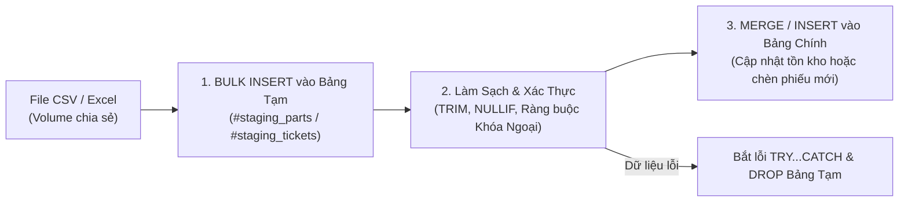

# 06. Cơ Chế Nhập Liệu Hàng Loạt (Bulk Data Import)

> **Hệ Quản Trị CSDL**: Microsoft SQL Server 2022  
> **Kỹ Thuật**: Native `BULK INSERT` kết hợp Bảng Tạm Staging (`#staging_*`) và Lệnh Hợp Nhất `MERGE`  
> **Mục Đích**: Tải dữ liệu quy mô lớn từ tệp tin CSV/Excel vào CSDL với tốc độ cao, xác thực dữ liệu trước khi lưu và bảo toàn toàn vẹn tham chiếu.

---

## 1. Kiến Trúc Quy Trình Nhập Dữ Liệu Staging (Staging Pattern)

Thay vì chèn trực tiếp dữ liệu thô từ file người dùng tải lên vào các bảng chính thức (dễ gây lỗi khóa bảng, rách dữ liệu nếu file có dòng lỗi ở giữa), hệ thống áp dụng **Quy trình Staging 3 bước**:



---

## 2. Chi Tiết Các Thủ Tục Nhập Liệu

### 2.1. `dbo.sp_bulk_import_parts`: Nhập hàng loạt linh kiện & Tự động hợp nhất tồn kho

#### Mục đích:
Cho phép Quản lý kho nhập danh mục hàng trăm linh kiện cùng lúc. Nếu linh kiện đã có sẵn trong kho thì tự động cộng dồn số lượng tồn kho mới và cập nhật giá mới; nếu là mặt hàng mới thì tự động chèn vào kho.

#### Luồng xử lý chi tiết:
1. Kiểm tra đường dẫn tệp tin `@csv_file_path` hợp lệ.
2. Khởi tạo bảng tạm `#staging_parts` trong `tempdb`.
3. Sử dụng Native `BULK INSERT` với cờ `TABLOCK` để tối ưu hóa ghi log giao dịch (Minimal Logging).
4. Sử dụng câu lệnh `MERGE`:
   - Khớp nối `ON target.part_name = source.part_name`.
   - `WHEN MATCHED`: Cộng dồn `target.stock_quantity = target.stock_quantity + source.stock_quantity` và cập nhật đơn giá mới nhất.
   - `WHEN NOT MATCHED`: Chèn bản ghi phụ tùng mới vào bảng `parts`.
5. Đếm số dòng tác động qua `@@ROWCOUNT` và trả về kết quả đối soát.

#### Mã nguồn T-SQL chi tiết:
```sql
CREATE OR ALTER PROCEDURE dbo.sp_bulk_import_parts
    @csv_file_path NVARCHAR(500),
    @rows_imported INT = 0 OUTPUT
AS
BEGIN
    SET NOCOUNT ON;

    IF @csv_file_path IS NULL OR LEN(@csv_file_path) = 0
        THROW 50060, N'CSV file path cannot be empty.', 1;

    -- 1. Bảng tạm chứa dữ liệu thô từ file CSV
    CREATE TABLE #staging_parts (
        part_name      NVARCHAR(100),
        unit           VARCHAR(20),
        price          DECIMAL(18,2),
        stock_quantity INT
    );

    BEGIN TRY
        -- 2. Đọc file cực nhanh bằng BULK INSERT
        DECLARE @sql NVARCHAR(MAX) = N'
            BULK INSERT #staging_parts
            FROM ''' + REPLACE(@csv_file_path, '''', '''''') + N'''
            WITH (
                FORMAT = ''CSV'',
                FIRSTROW = 2,
                FIELDTERMINATOR = '','',
                ROWTERMINATOR = ''0x0a'',
                TABLOCK
            );';

        EXEC sp_executesql @sql;

        -- 3. Hợp nhất dữ liệu vào bảng chính thức
        MERGE dbo.parts AS target
        USING (
            SELECT 
                TRIM(part_name) AS part_name,
                ISNULL(NULLIF(TRIM(unit), ''), 'piece') AS unit,
                CAST(price AS DECIMAL(18,2)) AS price,
                CAST(stock_quantity AS INT) AS stock_quantity
            FROM #staging_parts
            WHERE NULLIF(TRIM(part_name), '') IS NOT NULL 
              AND price >= 0 
              AND stock_quantity >= 0
        ) AS source
        ON target.part_name = source.part_name
        WHEN MATCHED THEN
            UPDATE SET 
                target.stock_quantity = target.stock_quantity + source.stock_quantity,
                target.price = source.price,
                target.updated_at = GETDATE()
        WHEN NOT MATCHED THEN
            INSERT (part_name, unit, price, stock_quantity, created_at, updated_at)
            VALUES (source.part_name, source.unit, source.price, source.stock_quantity, GETDATE(), GETDATE());

        SET @rows_imported = @@ROWCOUNT;

        -- 4. Trả về kết quả đối soát
        SELECT 
            @rows_imported AS rows_affected,
            (SELECT COUNT(1) FROM #staging_parts) AS total_rows_read;

        DROP TABLE #staging_parts;
    END TRY
    BEGIN CATCH
        IF OBJECT_ID('tempdb..#staging_parts') IS NOT NULL
            DROP TABLE #staging_parts;
        DECLARE @import_err NVARCHAR(2048) = ERROR_MESSAGE();
        THROW 50062, @import_err, 1;
    END CATCH;
END;
GO
```

---

### 2.2. `dbo.sp_bulk_import_tickets`: Nhập hàng loạt phiếu dịch vụ tiếp nhận

#### Mục đích:
Hỗ trợ di chuyển dữ liệu từ hệ thống cũ hoặc nhập danh sách thiết bị bảo hành định kỳ từ các đối tác doanh nghiệp lớn.

#### Luồng xử lý chi tiết:
1. Khởi tạo bảng tạm `#staging_tickets`.
2. Nạp dữ liệu từ CSV vào bảng tạm bằng `BULK INSERT`.
3. Kiểm tra tính toàn vẹn tham chiếu khóa ngoại: Chỉ những dòng có `s.device_id` tồn tại trong bảng `dbo.devices` mới được phép chèn vào CSDL (`JOIN dbo.devices d ON d.id = s.device_id`).
4. Chuẩn hóa loại dịch vụ: Nếu giá trị không thuộc `('repair', 'warranty', 're_repair')` thì tự động fallback về `repair`.
5. Thiết lập trạng thái mặc định của phiếu mới là `received`.

#### Mã nguồn T-SQL chi tiết:
```sql
CREATE OR ALTER PROCEDURE dbo.sp_bulk_import_tickets
    @csv_file_path   NVARCHAR(500),
    @receptionist_id INT = 1,
    @rows_imported   INT = 0 OUTPUT
AS
BEGIN
    SET NOCOUNT ON;

    IF @csv_file_path IS NULL OR LEN(@csv_file_path) = 0
        THROW 50060, N'CSV file path cannot be empty.', 1;

    -- Đảm bảo receptionist_id hợp lệ
    IF NOT EXISTS (SELECT 1 FROM employees WHERE id = @receptionist_id)
        SELECT TOP 1 @receptionist_id = id FROM employees WHERE role IN ('manager', 'receptionist');

    CREATE TABLE #staging_tickets (
        device_id         INT,
        ticket_type       VARCHAR(20),
        issue_description NVARCHAR(500),
        initial_condition NVARCHAR(200),
        accessories       NVARCHAR(200),
        estimated_cost    DECIMAL(18,2)
    );

    BEGIN TRY
        DECLARE @sql NVARCHAR(MAX) = N'
            BULK INSERT #staging_tickets
            FROM ''' + REPLACE(@csv_file_path, '''', '''''') + N'''
            WITH (
                FORMAT = ''CSV'',
                FIRSTROW = 2,
                FIELDTERMINATOR = '','',
                ROWTERMINATOR = ''0x0a'',
                TABLOCK
            );';

        EXEC sp_executesql @sql;

        -- Xác thực khóa ngoại và chèn vào bảng tickets chính thức
        INSERT INTO dbo.tickets (
            device_id,
            receptionist_id,
            technician_id,
            ticket_type,
            issue_description,
            initial_condition,
            accessories,
            estimated_cost,
            status,
            received_at,
            created_at,
            updated_at
        )
        SELECT 
            s.device_id,
            @receptionist_id,
            NULL,
            CASE 
                WHEN LOWER(TRIM(s.ticket_type)) IN ('repair', 'warranty', 're_repair') 
                THEN LOWER(TRIM(s.ticket_type)) 
                ELSE 'repair' 
            END,
            ISNULL(NULLIF(TRIM(s.issue_description), ''), N'Tiếp nhận thiết bị sửa chữa'),
            NULLIF(TRIM(s.initial_condition), ''),
            NULLIF(TRIM(s.accessories), ''),
            CASE WHEN s.estimated_cost >= 0 THEN s.estimated_cost ELSE 0 END,
            'received',
            GETDATE(),
            GETDATE(),
            GETDATE()
        FROM #staging_tickets s
        JOIN dbo.devices d ON d.id = s.device_id;

        SET @rows_imported = @@ROWCOUNT;

        SELECT 
            @rows_imported AS rows_affected,
            (SELECT COUNT(*) FROM #staging_tickets) AS total_rows_read;

        DROP TABLE #staging_tickets;
    END TRY
    BEGIN CATCH
        IF OBJECT_ID('tempdb..#staging_tickets') IS NOT NULL
            DROP TABLE #staging_tickets;

        DECLARE @err NVARCHAR(2048) = ERROR_MESSAGE();
        THROW 50062, @err, 1;
    END CATCH;
END;
GO
```

---

## 3. Tích Hợp Hệ Thống Với Tầng Ứng Dụng (Full-stack Integration)

1. **Volume Trao Đổi Tệp**: Thư mục `database/exchange/` được gắn mount vào container SQL Server tại `/var/opt/mssql/backup/`.
2. **Xử lý tại Backend (NestJS)**:
   - Client tải file lên qua API `POST /api/database/import/parts`.
   - Backend lưu file tạm vào volume trao đổi.
   - Gọi Stored Procedure:
     ```typescript
     await this.dataSource.query(`EXEC dbo.sp_bulk_import_parts @csv_file_path = @0`, [filePath]);
     ```
   - Dọn dẹp file tạm và phản hồi số lượng bản ghi nhập thành công về giao diện người dùng.
