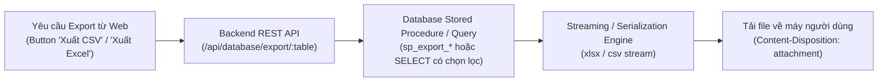

# 07. Cơ Chế Xuất Dữ Liệu & Báo Cáo (Data Export)

> **Hệ Quản Trị CSDL**: Microsoft SQL Server 2022  
> **Định Dạng Đầu Ra**: CSV (RFC 4180) & Microsoft Excel (.xlsx)  
> **Mục Đích**: Trích xuất dữ liệu kho hàng, nhật ký hóa đơn kế toán, danh sách phiếu dịch vụ phục vụ kiểm toán độc lập và báo cáo thống kê quản trị.

---

## 1. Tổng Quan Kiến Trúc Xuất Dữ Liệu

Quy trình xuất dữ liệu từ Database Engine ra file tải về trên trình duyệt:



---

## 2. Chi Tiết Các Thủ Tục Xuất Dữ Liệu Trong CSDL

### 2.1. `dbo.sp_export_parts_data`: Trích xuất danh mục kho linh kiện

#### Mục đích:
Cung cấp tập dữ liệu danh mục phụ tùng, đơn vị tính, đơn giá niêm yết, số lượng tồn kho và các mốc thời gian cập nhật để kế toán kiểm kê kho định kỳ.

#### Đặc tả kỹ thuật:
- **Chuẩn hóa thời gian**: Sử dụng hàm `FORMAT(created_at, 'yyyy-MM-dd HH:mm:ss')` để định dạng chuẩn quốc tế ISO, tránh xung đột định dạng ngày/tháng (DD/MM vs MM/DD) khi mở trên Excel các ngôn ngữ khác nhau.
- **Sắp xếp**: Sắp xếp tăng dần theo khóa chính `id ASC`.

#### Mã nguồn T-SQL:
```sql
CREATE OR ALTER PROCEDURE dbo.sp_export_parts_data
AS
BEGIN
    SET NOCOUNT ON;
    SELECT 
        id, 
        part_name, 
        unit, 
        price, 
        stock_quantity, 
        FORMAT(created_at, 'yyyy-MM-dd HH:mm:ss') AS created_at,
        FORMAT(updated_at, 'yyyy-MM-dd HH:mm:ss') AS updated_at
    FROM dbo.parts
    ORDER BY id ASC;
END;
GO
```

---

### 2.2. `dbo.sp_export_invoices_data`: Trích xuất sổ cái hóa đơn kế toán

#### Mục đích:
Xuất toàn bộ lịch sử thanh toán các hóa đơn dịch vụ đã phát hành để đối soát doanh thu tài chính, tiền công thợ, số tiền miễn giảm bảo hành và hình thức thanh toán.

#### Đặc tả kỹ thuật:
- Lấy thông tin phiếu liên kết `ticket_id`, tiền công `labor_fee`, tiền giảm trừ `discount_amount`, tổng thực thu `total_amount`.
- Phương thức thanh toán `payment_method` (`cash`, `bank_transfer`, `credit_card`).
- Thời điểm thu tiền `paid_at` và ngày lập hóa đơn `created_at`.

#### Mã nguồn T-SQL:
```sql
CREATE OR ALTER PROCEDURE dbo.sp_export_invoices_data
AS
BEGIN
    SET NOCOUNT ON;
    SELECT 
        i.id,
        i.ticket_id,
        i.labor_fee,
        i.discount_amount,
        i.total_amount,
        i.payment_method,
        FORMAT(i.paid_at, 'yyyy-MM-dd HH:mm:ss') AS paid_at,
        FORMAT(i.created_at, 'yyyy-MM-dd HH:mm:ss') AS created_at
    FROM dbo.invoices i
    ORDER BY i.id ASC;
END;
GO
```

---

## 3. Cơ Chế Xuất Dữ Liệu An Toàn Tầng Ứng Dụng (Database Admin Service)

Ngoài các stored procedure chuyên biệt ở trên, hệ thống tích hợp dịch vụ xuất dữ liệu an toàn tổng quát:

1. **Bộ lọc trường nhạy cảm (Security Masking)**:
   - Khi xuất bảng `employees`, trường mật khẩu `password_hash` **tuyệt đối bị loại bỏ khỏi danh sách SELECT** để bảo vệ an toàn thông tin nhân sự.
2. **Hỗ trợ định dạng kép**:
   - `CSV`: Tương thích mọi phần mềm phân tích dữ liệu, nhẹ, tốc độ sinh file mili-giây.
   - `Excel (.xlsx)`: Tự động căn chỉnh độ rộng cột, in đậm tiêu đề dòng đầu và định dạng kiểu số/tiền tệ chuẩn cho kế toán.
3. **Các điểm kích hoạt trên Web CRM**:
   - Màn hình **Quản lý phiếu (`/tickets`)**: Nút *"Xuất CSV"*.
   - Màn hình **Kho linh kiện (`/inventory`)**: Nút *"Xuất CSV"*.
   - Màn hình **Danh sách hóa đơn (`/invoices`)**: Nút *"Xuất Excel"*.
   - Màn hình **Quản trị CSDL (`/database`)**: Xuất bảng tùy chọn trực tiếp.
